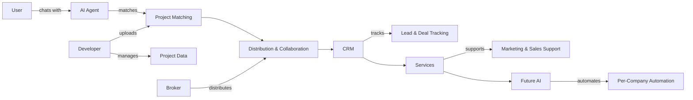

# Anan: A Multi-Channel Real Estate Infrastructure

> **Read this before every task involving Anan.** This is the single source of truth for the platform's identity, structure, and philosophy.

---

## 1. Core Concept

Anan is a **centralized real estate platform** connecting three parties:

| Party | Role |
|-------|------|
| **Users** (Buyers / Investors) | Interact via AI Agent → receive recommendations → close deals |
| **Developers (RED)** | Upload projects, create offers, track performance, manage brokers |
| **Brokers** | Distribute properties, collaborate, close deals, manage clients |

**Goal:** Unify data, distribution, collaboration, and sales execution inside a single ecosystem.

---

## 2. User Side (Buyer / Investor Flow)

**Current entry point:** WhatsApp AI Agent
**Future:** Dedicated mobile app, additional channels, embedded AI agents in external systems

### User Flow
1. User chats with the AI agent
2. AI collects structured info: budget, area, property type, payment method, timeline, intent (residential vs investment)
3. AI processes against available projects, properties, offers, and financing logic
4. AI responds with: recommended properties, structured comparison, summary report, optional PDF download
5. Handover to broker/developer, sales team routing, or future automated workflow

> The AI agent is a **dynamic sales and qualification channel**, not just a chatbot.

---

## 3. Developer Side (Partner Dashboard)

**Philosophy:** No mandatory contracts, no manual onboarding. Simply "Login → Add project → Activate".

### A. Overview Section
Real-time aggregated data providing **live market intelligence** from actual user behavior:
- Most requested areas & searched price ranges
- Active demand trends & most converted property types
- Engagement metrics, project performance analytics, sales tracking

### B. Projects Section
- Upload images, unit details, pricing, locations, payment plans, descriptions
- **Visibility:** Public (all brokers) or Private (selected brokers only)
- One-click distribution into the AI Agent
- Performance tracking per project
- Branded PDF export (logos, images, structured layout)
- Future: One-click integration to external systems

### C. Offers Section
- Developers define commission rules & eligibility terms
- Offers can be open (all brokers) or restricted (select group)
- Brokers view, apply, and collaborate → competitive, performance-driven broker layer

### D. Brokers Tab
- Browse broker profiles & performance indicators
- Track deal progress, assign projects, monitor activity
- Direct communication with brokers

### E. Lightweight CRM
- Drag-and-drop interface
- Track: leads, assigned brokers, client statuses, stage progressions, deal pipelines, closed deals, broker performance
- **Purpose:** Everything visible in one dashboard — no need to call brokers for updates

---

## 4. Broker Side

### A. Overview
Active projects, assigned deals, performance metrics, pipeline statuses, conversion tracking

### B. Projects
- View & apply for developer projects
- Add own projects & push to AI Agent
- Track performance

### C. Offers & Collaboration
Two models:
1. **Apply to developer offers** — standard commission model
2. **Broker-to-broker collaboration** — if Broker A has client + Broker B has matching project → connect, split commission, close faster

> This creates a **private collaboration marketplace**.

### D. Developers Tab
View developers, connect directly, access projects centrally (no physical visits needed)

### E. Broker CRM
Track clients, standard deals, collaboration deals, stage progress, deal ownership

---

## 5. Multi-Channel Sales Architecture

Anan is a **layered distribution system**, not an isolated marketing channel:

```
┌─────────────────────────────────────────────┐
│  AI Agent (WhatsApp + future app)            │
│  Broker Network                              │
│  Developer Direct Assignment                 │
│  Sales Team (optional)                       │
│  Broker Collaboration Layer                  │
│  Service-Driven Marketing Support            │
│  Future: Dedicated AI Agents per Company     │
└─────────────────────────────────────────────┘
```

---

## 6. Services Layer

Integrated freelancer marketplace:
- Landing pages, social media, content, design, campaigns, specialized RE marketing
- Freelancers are pre-selected, trained in real estate, fully integrated
- **Goal:** Reduce friction in launching and selling projects

---

## 7. Future Product Expansion

### Dedicated AI Customer Service Agent (Per Company)
- Since project data is already uploaded, developers can **instantly create a branded AI agent**
- The AI understands all projects, pricing, payment plans, company identity
- Handles customer conversations, filters non-serious inquiries, delivers qualified leads
- Features: WhatsApp campaigns, template messaging, automated follow-ups, customer segmentation
- Connected directly to Anan's main infrastructure

---

## 8. Data Intelligence Layer

Live demand analysis provides:
- Most searched areas & requested budgets
- Emerging trends & conversion zones
- Market heat mapping

**Use cases for developers:** Where to build next, pricing strategies, ad spend optimization, inventory mix improvement

---

## 9. Operational Philosophy

| Principle | Description |
|-----------|-------------|
| **No complexity** | Simple onboarding, intuitive interfaces |
| **No forced contracts** | Freedom to use basic features or full ecosystem |
| **No fragmented systems** | Single dashboard with real-time transparency |
| **Modular expansion** | Scale up progressively as needed |

---

## 10. Full Cycle Summary



> **Anan is not just a listing platform, nor a CRM, nor an AI chatbot — it is a complete infrastructure.**

---

## Zone Mapping (Codebase ↔ Platform)

| Platform Concept | Frontend Zone | Backend Zone | Key Responsibilities |
|-----------------|---------------|--------------|---------------------|
| Admin / Platform Operations | `admin_zone` | `convex/admin_zone` | User management, partner management, knowledge, orders, analytics, dev tools |
| Broker Dashboard | `broker_zone` | `convex/broker_zone` | Broker overview, properties, offers, CRM |
| Developer (RED) Dashboard | `red_zone` | `convex/red_zone` | Developer overview, projects, offers, broker management |
| Buyer / User | `user_zone` | `convex/user_zone` | User-facing features, property search |
| AI / Anan Agent | — | `convex/ai_zone` | AI agent logic, search actions, knowledge retrieval |
| Shared Domain Logic | `shared_logic` | `convex/shared_logic` | Properties, offers, dashboard queries, middleware |
| Landing / Auth | `public_zone` | `convex/public_zone` | Public pages, authentication |
| Core Infrastructure | `core` | `convex/_core` | Schema, auth, HTTP, routing, shared libs |

---

## Rules for AI Agents Working on Anan

1. **Zone boundaries are strict.** Never import directly between zones — use the zone's public hooks or exported functions.
2. **View/Logic separation is mandatory.** Page components only render UI; all API logic lives in custom hooks inside the zone's `hooks/` directory.
3. **Backend API handlers must be thin controllers.** Delegate business logic to internal services.
4. **When in doubt, check the zone's `ZONE_README.md`** for its public API, ownership, and rules.
5. **The platform serves three audiences simultaneously.** Every feature decision must consider the User ↔ Developer ↔ Broker triangle.
6. **Data intelligence is a first-class feature.** When adding new data flows, consider what analytics/insights can be derived for the Data Intelligence Layer.
7. **Multi-channel thinking.** The AI Agent is the primary user channel today, but design for channel-agnostic data models.

### Strict "Anan Architecture" Coding Rules (Backend & Frontend)
To prevent "messing up" the architecture, all agents MUST follow these rigorous formatting and structural rules on every file they touch:
- **The Orchestrator Pattern:** Do not build 400-line monolithic files. Break complex pages (frontend) or agents (backend) into a `Folder/` where `index.ts(x)` acts as the thin Orchestrator, delegating to focused sub-components/teams.
- **JSDoc `WHY/WHAT/HOW` Comments:** EVERY exported component, function, hook, or class MUST have a JSDoc block at the top clearly dictating:
  - `WHY:` Why this exists / its business purpose.
  - `WHAT:` What it technically does (inputs/outputs).
  - `HOW:` Any specific mechanisms, edge cases, or state rules.
- **`README.md` Manifests:** Every major folder (`pages/SpecificPage/`, `agents/team_name/`) must contain a `README.md` defining its internal structure and responsibilities.
- **Total Isolation:** In the frontend, if a page has sub-components (like `ConversationTab.tsx`), those files MUST be inside the page's directory (e.g., `UserDetail/tabs/ConversationTab.tsx`), NOT floating in a generic `components/` folder unless they are truly shared across the whole app.

### Architecture Decision Rules (Bad vs Good Decisions)
Agents must evaluate architecture decisions, not just code style. Every non-trivial change should be judged by whether it strengthens Anan's business architecture now while still fitting the future multi-channel platform.

- **Always explain the architecture choice.** Do not stop at "bad code" vs "good code". State the `bad decision`, the `good decision`, and why the good one better matches Anan's platform model.
- **Business architecture comes first.** A technically clever solution is still wrong if it breaks the User ↔ Developer ↔ Broker operating model, hides data needed by another audience, or hard-codes one team's workflow into shared infrastructure.
- **Build for today's product and tomorrow's channels.** Prefer decisions that work for WhatsApp today without trapping the platform away from future app, dashboard, automation, and partner-channel expansion.
- **Functions must represent business capabilities clearly.** A function should do one coherent job, have a name that reads like a real capability, and be easy for another engineer to reuse without reading five files first.
- **Functions must be collaborator-friendly.** A teammate should be able to understand a function from its name, signature, JSDoc, and folder placement. If a colleague cannot predict when to use it, the architecture is too muddy.
- **Thin entrypoints, strong domain services.** Public actions, handlers, hooks, and page shells should orchestrate. The real rules belong in small domain functions/services with explicit inputs and outputs.

#### How to Write Bad Decision vs Good Decision

Use this format in architecture reviews, major code comments, PR summaries, and skill-guided implementation notes:

```md
Bad decision:
- What choice would have been made?
- Why does it hurt zone boundaries, reuse, or the business model?

Good decision:
- What choice should be made instead?
- Why does it better support Anan now and in the future?
```

#### Example: Architecture Decision

```md
Bad decision:
- Put broker-specific matching logic directly inside the WhatsApp agent flow.
- This makes the AI channel the owner of a shared business rule and blocks reuse in dashboards, automations, and future APIs.

Good decision:
- Move matching logic into a shared domain service and let the WhatsApp agent call it as one channel.
- This keeps the business rule channel-agnostic and allows the same logic to power the future app, broker tools, and developer analytics.
```

#### Example: Function Design

```ts
/**
 * WHY: Decide which projects are relevant to a qualified lead across channels.
 * WHAT: Accepts normalized lead criteria and returns ranked project matches.
 * HOW: Uses shared matching rules and does not depend on WhatsApp-specific payloads.
 */
export async function matchProjectsForLead(input: MatchProjectsForLeadInput) {
  // thin orchestration only
}
```

```ts
// Bad: channel-coupled, unclear business purpose, hard to reuse
export async function handleWhatsappMessage(data: any) {
  // qualification + matching + formatting + routing + persistence all mixed together
}
```

#### Quick Test for "Good" Functions

Before adding or changing a function, verify all of the following are true:

- The name reflects a business capability, not a UI click or transport event.
- Inputs are normalized domain inputs, not raw channel-specific payloads unless the function is deliberately an adapter.
- The function can be reused by another zone, teammate, or future channel with minimal rewriting.
- Side effects are explicit.
- The function lives in the zone or shared layer that owns the business rule.
