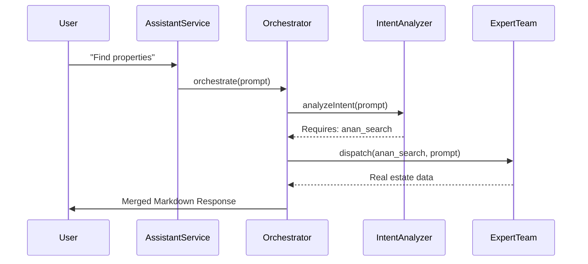

# Anan Platform: Architecture & Standards

Welcome to the Anan Real Estate Platform. This document outlines the absolute architectural rules that **must** be followed by both human developers and AI assistants. 

**CRITICAL:** Do NOT search the old legacy codebase for architecture patterns. Use ONLY the patterns described below.

---

## 1. Documentation Standards

Every single Orchestrator page, API hook, and major utility function in this repository **MUST** be documented with the following strict `WHY/WHAT/HOW` format:

```typescript
/**
 * WHY:   Explains the business or architectural reason this module exists.
 * WHAT:  Explains exactly what this module does or returns.
 * HOW:   Explains the mechanics, dependencies, and design patterns used.
 */
export function ComplexModule() { ... }
```
*If an AI generates code without this block, reject the code.*

---

The frontend now lives in Next.js apps under `apps/` with explicit role roots:
- `apps/admin`
- `apps/web`
- `apps/mobile`

The code is organized into:
- `app/` for App Router entrypoints
- `workspace/` for the shared shell and role navigation
- `admin_zone`, `broker_zone`, `red_zone`, `shared_logic` for feature modules and hooks

### The 4 Rules of a Fortress:

1. **Thin Route Files (`app/`)**
   Route files stay thin. They compose guards and shells, then hand off to focused page modules in the relevant zone.

2. **API Isolation (`api/`)**
   All data fetching (Convex queries, mutations) happens in the `api/` directory (e.g., `api/useBrokerData.ts`). Do not put hooks inside `/hooks` or scattered inside components. 

3. **Shared Shell (`workspace/`)**
   Admin, broker, and RED routes all use one shared shell and one shared session gate. Global layout changes should happen there once.

4. **The Orchestrator Pattern (`pages/`)**
   Page modules stay focused and delegate data access to `api/` hooks and shared components. Avoid rebuilding the same shell or auth flow per role.

#### Folder Structure Example:
```text
anan-ai/
├── apps/
│   ├── admin/
│   ├── web/
│   └── mobile/
├── packages/
│   └── shared_logic/
├── convex/
│   └── ai_zone/
```

### Package Extraction Rule

`packages/*` is reserved for stable shared systems, not just heavy folders.

Move code into a package only when it is already reused across apps/projects, or when it is clearly being shaped as a durable public surface with stable entrypoints, documentation, and tests. If code is large but still belongs to one app or one backend zone, keep it local and improve the local architecture first with thinner orchestrators, clearer ownership, and better folder boundaries.

Use `@anan/ag-ui` as the reference pattern:
- generic reusable core in `packages/*`
- app-specific behavior behind adapter entrypoints
- thin local wrappers only where a host surface still needs its own contract

### Packaging Readiness Checklist

Before extracting a new package, confirm all of the following:
- the module is reused, or intentionally designed for reuse, beyond one owning surface
- the public entrypoints and ownership are stable enough to document
- README/examples are justified and maintainable
- the package can be typechecked and tested independently from the host app
- app-specific dependencies can be isolated behind adapters instead of leaking into the core API

If those points are not true yet, do not package it.

### Destination Buckets

When auditing heavy code, classify it into exactly one of these homes:
- `packages/*`
  Stable shared systems with reusable APIs and independent docs/tests
- local shared folders
  App-wide shared code that still belongs to one runtime surface
- zone-local folders
  Behavior tied tightly to one page, workspace subsystem, or backend zone

---

## 3. Backend: The Multi-Agent Orchestrator

The AI backend (`convex/ai_zone/agents/`) has been completely refactored from a single monolith into a hierarchical Multi-Agent system. 

### The Brain (`anan/`)
The `anan` directory is the master orchestrator. When the frontend requests AI assistance via `assistantService.ts`, it calls `anan.orchestrate()`.



### The Teams & Agents
Agents are separated into discrete "Teams". Each team has specialized agents capable of specific tools.

1. `team_search`: `anan_search`, `anan_web`
2. `team_property`: `anan_property`, `anan_recommender`
3. `team_finance`: `anan_finance`, `anan_banks`
4. `team_knowledge`: `anan_knowledge`, `anan_memory`
5. `team_trainer`: `anan_trainer`

### Adding a New Agent
1. Create a folder in the relevant team: `team_X/anan_new_agent/`.
2. Create `config.ts` wrapping the `AnanAgent` base class (found in `shared/AnanAgent.ts`).
3. Define the LLM Prompt, required Tools, and Model.
4. If it requires new tools, add them to `team_X/tools/`.
5. Register the agent inside `anan/teamRegistry.ts`.

### Shared Infrastructure
Always utilize the files in `ai_zone/agents/shared/`:
- `errorHandler.ts`: Wrap external calls for exponential backoff and jitter.
- `tokenTracker.ts`: Record prompt/completion dimensions per agent request accurately.
- `ragInstances.ts`: Use pre-configured RAG vectors rather than building raw queries.

---

## 4. Coding Golden Rules

- **Zero TypeScript Errors:** Do not commit `// @ts-ignore` or `any` unless absolutely forced by external libraries. Type your data structures.
- **Never mutate state directly:** Always use immutable updates.
- **Small functions:** An orchestrator file should rarely exceed 150-200 lines. If it does, abstract the UI into sub-components.
- **Follow the Breadcrumbs:** When assigned a task, look at the `ZONE_README.md` and read the `index.ts` gateway first to understand the landscape. Do not barge in and create files anywhere.
- **Package only shared systems:** Do not move code to `packages/*` just because it is large; package only stable cross-surface or cross-project systems with clear public APIs.
