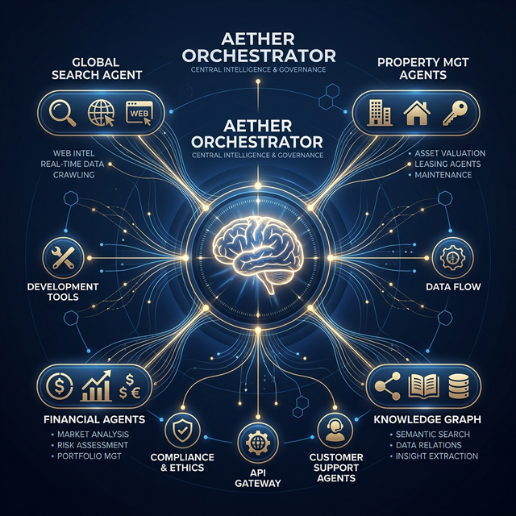
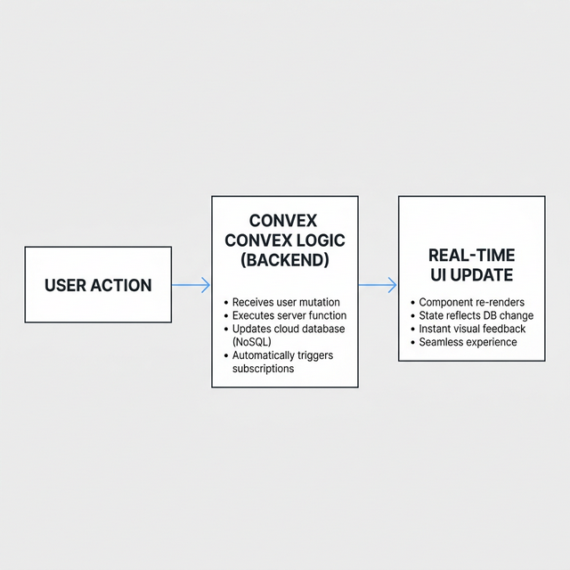
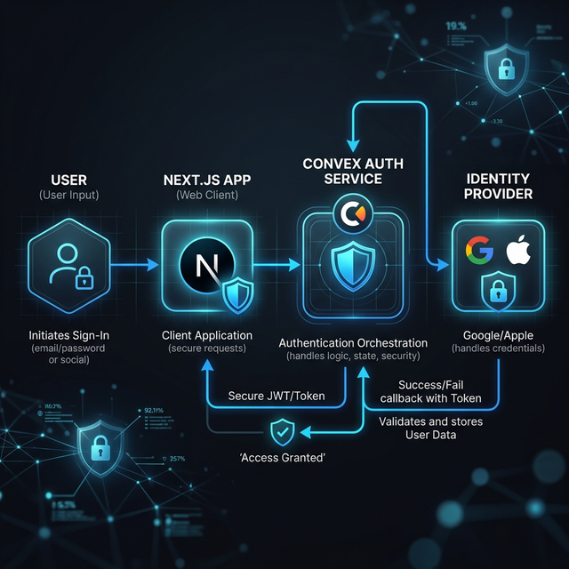
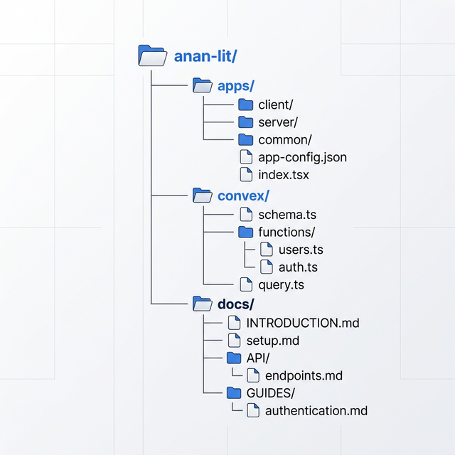
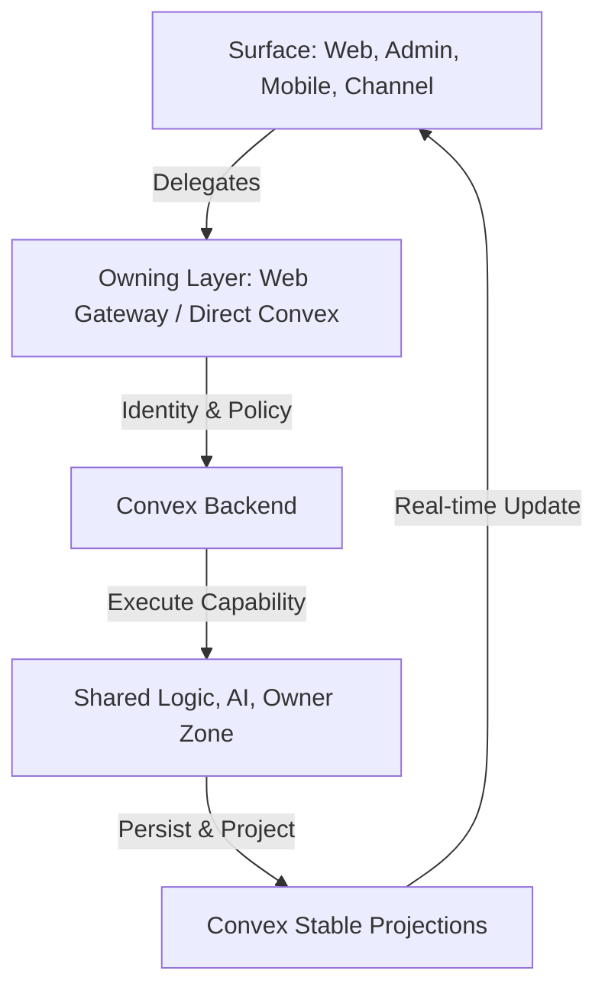
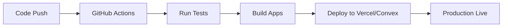

# Anan AI — Developer Bible (Index)

Anan AI is a **multi-surface real estate platform** built around a **Convex-first backend**.

This repo contains four runtime surfaces that all share one backend:

- `apps/web` — public site + broker/developer workspace
- `apps/admin` — operations console (in-app handbook at `/docs`)
- `apps/mobile` — buyer-facing Expo app
- `convex` — schema, auth, access policy, shared logic, AI orchestration, channels, HTTP/OAuth ingress

---

## Start here (required)

1. `ARCHITECTURE.md` — absolute architectural standards (thin entrypoints, zone ownership, WHY/WHAT/HOW).
2. `CONVEX_RULES.md` — “God rules” for writing queries/mutations/actions and channel handlers safely.
3. `docs/handbook/README.md` — deep, split-by-folder handbook for Convex + web gateway + channels + admin + mobile.

Supporting references:

- `docs/developer-system-guide.md`
- `docs/codebase-knowledge-base.md`
- `docs/llm-data-access-guide.md`
- `docs/logic-audit-2026-03-13.md`

---

## 🏗️ System Architecture



Anan AI utilizes a **Multi-Agent Orchestrator** to handle complex user intents across search, finance, and property management.

### Developer Flow (Simplified)


```mermaid
sequenceDiagram
    participant User
    participant AssistantService
    participant Orchestrator (anan)
    participant IntentAnalyzer
    participant Team (e.g., team_search)
    
    User->>AssistantService: Input Prompt
    AssistantService->>Orchestrator: orchestrate(prompt)
    Orchestrator->>IntentAnalyzer: analyzeIntent(prompt)
    IntentAnalyzer-->>Orchestrator: Required Agents
    Orchestrator->>Team: dispatch(agent, prompt)
    Team-->>Orchestrator: Data/Response
    Orchestrator->>User: Merged Markdown Response
```

### 🔐 Security & Authentication


Anan AI uses a robust authentication flow orchestrated via Convex and integrated with major Identity Providers.

### 🌐 Real-time Data Sync


Every surface in the Anan AI ecosystem is a real-time subscriber to the Convex state, ensuring sub-second latency across global interfaces.

---

## 🔄 The “circle” (how the platform works)


### Monorepo Structure


1. A surface receives input (web/admin/mobile/channel).
2. The surface delegates to the owning layer (web gateway or direct Convex).
3. Convex resolves identity + access policy.
4. Convex executes a capability (shared logic / AI / owner zone).
5. Convex persists and returns stable projections.
6. The surface renders and often subscribes to real-time updates.



Break the circle and you break the platform.

### 🚀 CI/CD & Deployment



Anan AI is continuously deployed via automated pipelines, ensuring that every commit is verified and shipped to the global edge.

---

## Local development

Install:

```bash
pnpm install
```

Backend + apps:

```bash
pnpm dev          # Convex dev (backend)
pnpm dev:all      # backend + web + admin
pnpm dev:web
pnpm dev:admin
pnpm mobile:dev
```

Build + tests:

```bash
pnpm build
pnpm test:once
```

---

## Repo rules (short version)

- Keep route files and HTTP handlers **thin**.
- Respect **zone boundaries** (`convex/*` zones and `apps/*` ownership).
- Prefer **index-first + paginated** queries; avoid list-then-reduce reads.
- Use **contracts** at boundaries (normalize naming only at the boundary).
- Keep public web routes **SSR/static-friendly**; avoid client-by-default patterns.

