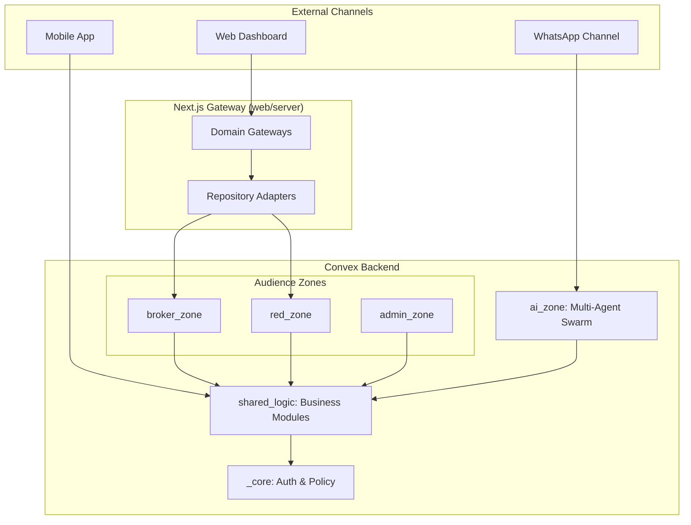

# Anan Platform: Technical Manifesto

**Anan** is a high-tech, multi-surface real estate ecosystem designed for the Kingdom of Saudi Arabia. It aligns with **Vision 2030** by transforming the real estate sector into a transparent, efficient, and AI-powered intelligence engine.

---

## 🚀 Technology Stack

Anan is built on a modern, high-performance stack optimized for real-time interaction and AI orchestration:

-   **Frontend**: Next.js 15 (App Router), React 19, Tailwind CSS v4, Framer Motion, GSAP (for complex timelines), Lucide Icons.
-   **Backend**: [Convex](https://www.convex.dev/) (Real-time DB, Serverless Functions, Crons, HTTP Actions).
-   **Mobile**: React Native, Expo, Expo Router.
-   **AI Infrastructure**: Custom Multi-Agent Orchestrator, OpenAI/Anthropic/Google LLM Providers, Pinecone (optional for specialized RAG).
-   **Package Management**: PNPM Workspaces, Bun (Runner).

---

## 🧩 Architecture Deep Dive

The platform follows a **Hierarchical Zone Architecture**. This ensures that business logic is strictly isolated and client surfaces stay thin.

### Architecture Flowchart


---

## 🛠️ Installation & Setup

### 1. Prerequisites
- **Node.js 20+** and **PNPM 9+**.
- **Bun** (optional, recommended for script execution).
- A **Convex** account (`npx convex dev`).

### 2. Initialization
```bash
git clone <repo-url>
cd anan-lit
pnpm install
```

### 3. Environment Configuration
Create a `.env.local` in the root and configure the following:
```env
CONVEX_DEPLOYMENT_URL=...
NEXT_PUBLIC_CONVEX_URL=...
OPENAI_API_KEY=...
ANTHROPIC_API_KEY=...
```

### 4. Running the Stack
```bash
pnpm run dev      # Boots Next.js Web + Convex Backend
```

---

## 🤖 AI Extension Guide

Anan uses a specialized multi-agent system. Here is how you extend it:

### Adding a New Tool
1.  Navigate to `convex/ai_zone/agents/team_<name>/<agent_name>/tools/`.
2.  Create a new tool file (e.g., `calculateROI.ts`).
3.  Define the tool using standard Convex logic or a shared service.
4.  Export the tool metadata for the LLM to understand.

### Adding a New Agent
1.  **Create Config**: In `convex/ai_zone/agents/team_<name>/<agent_name>/config.ts`, define the `AgentDefinition`.
    ```typescript
    export const myAgentDefinition: AgentDefinition = {
        name: "my_agent",
        description: "What this agent does...",
        tools: { myNewTool },
        prompt: { ... }
    };
    ```
2.  **Register Agent**: Add the agent to the `TEAM_REGISTRY` in `convex/ai_zone/agents/anan/teamRegistry.ts`.
3.  **Register Team**: (Optional) Group multiple agents into a new team in the same registry.

---

## 📜 Coding Philosophy & Rules

-   **Thin Controllers**: Route files (App Router) must only handle entry and exit. All logic lives in `web/server` or `shared_logic`.
-   **Zone Ownership**: Never access data across zones directly. Use `shared_logic` as the broker.
-   **Why/What/How**: Every module must have JSDoc explaining its existence.
-   **Motion First**: Every UI interaction should feel premium. Default to `framer-motion` for state transitions.

---

## 📚 Resources

| Resource | Description |
| :--- | :--- |
| [System Guide](docs/developer-system-guide.md) | Granular technical setup and standards. |
| [Knowledge Base](docs/codebase-knowledge-base.md) | Living map of the entire codebase. |
| [AI & Data Access](docs/llm-data-access-guide.md) | How the LLM interacts with platform data. |
| [Logic Audit](docs/logic-audit-2026-03-13.md) | Security and logic verification results. |
