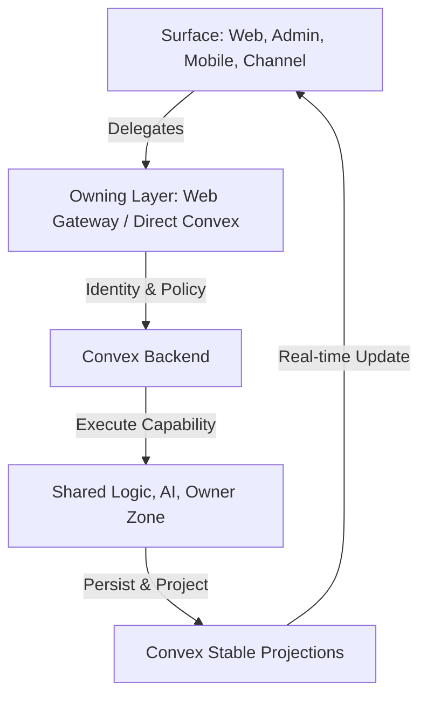

# Anan AI — Platform Overview

Anan AI is a **multi-surface real estate platform** built on a **Convex-first backend**. It connects **Users (buyers/investors)**, **Brokers**, and **Developers (RED)** through one shared system of data, rules, and AI-driven workflows.

🔒 **Private / closed-source / proprietary.** See `LICENSE` and `NOTICE.md`.

---

## What This Repo Contains

Four runtime surfaces, one backend:
- `apps/web` — public site + broker/developer workspace
- `apps/admin` — operations console (in-app handbook at `/docs`)
- `apps/mobile` — buyer-facing Expo app
- `convex` — schema, auth, access policy, shared logic, AI orchestration, channels, HTTP/OAuth ingress

---

## Technology + Architecture

**Core stack**
- Backend: **Convex** for schema, auth, access policy, business logic, AI orchestration, and channels.
- Web/Admin: **Next.js App Router**.
- Mobile: **Expo Router**.
- Language: **TypeScript** across the stack.

**Architecture model (the circle)**
Surface → Owning layer → Convex → Capability → Projection → UI.



**Backend zones (ownership boundaries)**
- `_core` — schema, auth, identity, access policy.
- `shared_logic` — shared business capabilities (offers, inbox, properties, market, knowledge).
- `ai_zone` — assistant endpoints, orchestration, channel adapters.
- `user_zone` — buyer/mobile endpoints.
- `admin_zone` — admin projections and operations.
- `broker_zone` — broker-scoped adapters and views.
- `red_zone` — developer (RED) adapters and views.
- `public_zone` — unauthenticated/public entry flows.

---

## How To Use This Repo

**1) Read the rules first**
- `ARCHITECTURE.md` — absolute architectural standards.
- `CONVEX_RULES.md` — rules for Convex queries/mutations/actions and channel handlers.
- `docs/handbook/README.md` — full handbook by area.

**2) Install**
```bash
pnpm install
```

**3) Configure auth redirects (required for Google OAuth)**
- Set `SITE_URL` (and optionally `ANAN_WEB_URL`) to the public web origin you want after sign-in.
- Set `ANAN_ADMIN_URL` for the admin app origin.
- Set `ANAN_MOBILE_URL` for the mobile app origin.
- If needed, set `ANAN_AUTH_ALLOWED_ORIGINS` (comma-separated) for extra safe redirects.

**4) Run locally**
```bash
pnpm dev          # Convex dev (backend)
pnpm dev:all      # backend + web + admin
pnpm dev:web
pnpm dev:admin
pnpm mobile:dev
```

**5) Build + test**
```bash
pnpm build
pnpm test:once
```

---

## Navigation Links (Rules + Architecture + Guides)

**Architecture and rules**
- `ARCHITECTURE.md` — platform architecture and standards.
- `CONVEX_RULES.md` — Convex “God rules”.
- `docs/handbook/security/README.md` — authZ and security patterns.

**Handbook (by area)**
- `docs/handbook/README.md` — master index.
- `docs/handbook/convex/README.md` — Convex mental model + zones.
- `docs/handbook/web/README.md` — web gateway + SSR rules.
- `docs/handbook/admin/README.md` — admin app rules.
- `docs/handbook/mobile/architecture.md` — mobile architecture flow.

**Project maps**
- `docs/codebase-knowledge-base.md` — current repo truth by surface.
- `docs/developer-system-guide.md` — system setup and workflow notes.
- `docs/llm-data-access-guide.md` — safe LLM access patterns.

---

## Quick Rules (Summary)

- Keep controllers and routes **thin**.
- Respect **zone boundaries** (no deep imports across zones).
- Put shared logic in `convex/shared_logic` once.
- Use **index-first** and **paginated** queries.
- Keep public web routes SSR/static-friendly.
