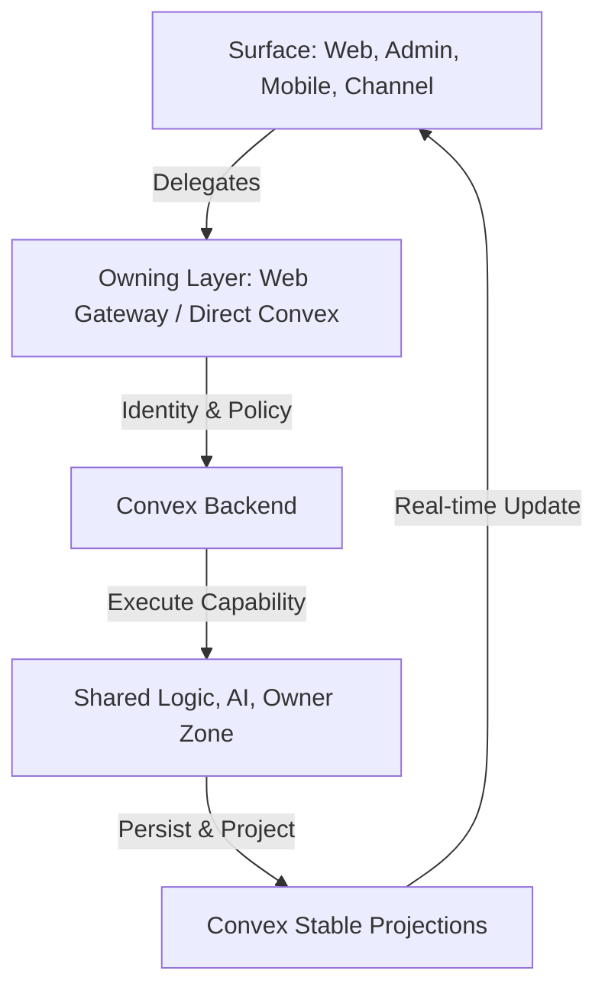
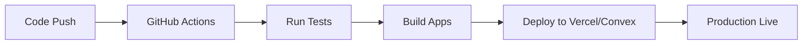

# Anan AI — Developer Bible 📚

🔒 **Private / closed-source / proprietary.** See `LICENSE` and `NOTICE.md`.

Anan AI is a **multi-surface real estate platform** built around a **Convex-first backend**.

This repo contains four runtime surfaces that all share one backend:

- `apps/web` — public site + broker/developer workspace
- `apps/admin` — operations console (in-app handbook at `/docs`)
- `apps/mobile` — buyer-facing Expo app
- `convex` — schema, auth, access policy, shared logic, AI orchestration, channels, HTTP/OAuth ingress

---

## Start here (required) 🧭

1. `ARCHITECTURE.md` — absolute architectural standards (thin entrypoints, zone ownership, WHY/WHAT/HOW).
2. `CONVEX_RULES.md` — “God rules” for writing queries/mutations/actions and channel handlers safely.
3. `docs/handbook/README.md` — deep, split-by-folder handbook for Convex + web gateway + channels + admin + mobile.
4. `docs/handbook/security/README.md` — security/authZ patterns and logical safety checklists.
5. `llm/README.md` — fast onboarding for LLMs and new engineers.

Supporting references:

- `docs/developer-system-guide.md`
- `docs/codebase-knowledge-base.md`
- `docs/llm-data-access-guide.md`
- `docs/logic-audit-2026-03-13.md`

---

## The “circle” (how the platform works) 🔄

1. A surface receives input (web/admin/mobile/channel).
2. The surface delegates to the owning layer (web gateway or direct Convex).
3. Convex resolves identity + access policy.
4. Convex executes a capability (shared logic / AI / owner zone).
5. Convex persists and returns stable projections.
6. The surface renders and often subscribes to real-time updates.



Break the circle and you break the platform.

---

## Docs index (by topic) 🗂️

- Convex backend: `docs/handbook/convex/README.md`
- Web gateway + SSR: `docs/handbook/web/README.md`
- Channels + webhooks: `docs/handbook/convex/channels.md`
- Security & AuthZ: `docs/handbook/security/README.md`
- LLM contribution rules: `docs/handbook/llm/README.md`

---

## CI/CD (recommended) 🚀



Configure your private pipelines to run `pnpm test:once` and `pnpm build` before deployment.

---

## Local development 🧪

Install:

```bash
pnpm install
```

Auth redirect base (required for Google OAuth):

- Set `SITE_URL` (and optionally `ANAN_WEB_URL`) to the **public web origin** you want to land on after Google sign-in (example: `http://localhost:3000`).
- If `SITE_URL` points to a `*.convex.site` URL, OAuth will redirect back to that domain (often not what you want for a “real domain” deploy).

Backend + apps:

```bash
pnpm dev          # Convex dev (backend)
pnpm dev:all      # backend + web + admin
pnpm dev:web
pnpm dev:admin
pnpm mobile:dev
```

Build + tests:

```bash
pnpm build
pnpm test:once
```

---

## Repo rules (short version) 🧱

- Keep route files and HTTP handlers **thin**.
- Respect **zone boundaries** (`convex/*` zones and `apps/*` ownership).
- Prefer **index-first + paginated** queries; avoid list-then-reduce reads.
- Use **contracts** at boundaries (normalize naming only at the boundary).
- Keep public web routes **SSR/static-friendly**; avoid client-by-default patterns.
