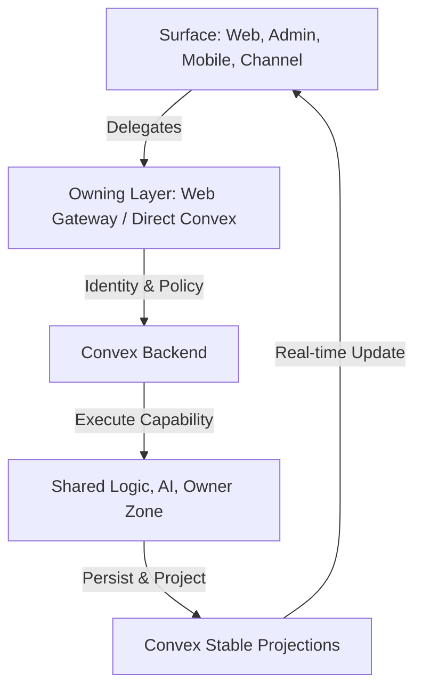
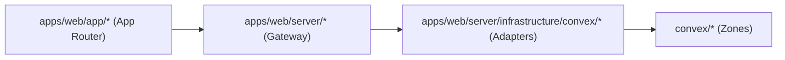
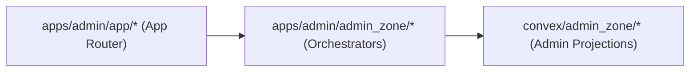
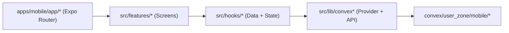
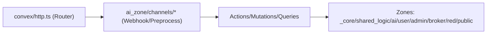
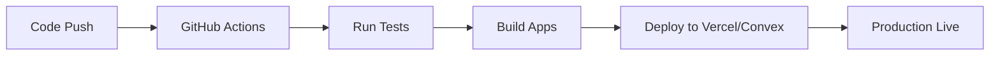

# Anan AI — Developer Bible 📚

🔒 **Private / closed-source / proprietary.** See `LICENSE` and `NOTICE.md`.

Anan AI is a **multi-surface real estate platform** built around a **Convex-first backend**.

This repo contains four runtime surfaces that all share one backend:

- `apps/web` — public site + broker/developer workspace
- `apps/admin` — operations console (in-app handbook at `/docs`)
- `apps/mobile` — buyer-facing Expo app
- `convex` — schema, auth, access policy, shared logic, AI orchestration, channels, HTTP/OAuth ingress

---

## Start here (required) 🧭

1. `ARCHITECTURE.md` — absolute architectural standards (thin entrypoints, zone ownership, WHY/WHAT/HOW).
2. `CONVEX_RULES.md` — “God rules” for writing queries/mutations/actions and channel handlers safely.
3. `docs/handbook/README.md` — deep, split-by-folder handbook for Convex + web gateway + channels + admin + mobile.
4. `docs/handbook/security/README.md` — security/authZ patterns and logical safety checklists.
5. `llm/README.md` — fast onboarding for LLMs and new engineers.

Supporting references:

- `docs/developer-system-guide.md`
- `docs/codebase-knowledge-base.md`
- `docs/llm-data-access-guide.md`
- `docs/logic-audit-2026-03-13.md`

---

## The “circle” (how the platform works) 🔄

1. A surface receives input (web/admin/mobile/channel).
2. The surface delegates to the owning layer (web gateway or direct Convex).
3. Convex resolves identity + access policy.
4. Convex executes a capability (shared logic / AI / owner zone).
5. Convex persists and returns stable projections.
6. The surface renders and often subscribes to real-time updates.



Break the circle and you break the platform.

---

## Emoji Thread (Overview → Tech → Architecture → Flows) ✨

**🚀 Project Overview**
- Anan is a multi-surface real estate platform: Web + Admin + Mobile + Channels.
- It serves 3 audiences: Users (buyers/investors), Brokers, Developers (RED).
- It is Convex-first: one backend powers all surfaces with shared rules and data truth.

**🧰 Technology In The Project (High-Level)**
- Convex for backend runtime, data, auth, access control, AI orchestration, and channels.
- Next.js App Router for Web + Admin.
- Expo Router for Mobile.
- TypeScript across the stack with shared contracts and DTOs.

**🧭 Architecture Overview (The Circle)**
Surface → Owning layer → Convex → Capability → Projection → UI.
```mermaid
graph TD
    A[Surface: Web, Admin, Mobile, Channel] --> B[Owning Layer: Web Gateway / Direct Convex]
    B --> C[Convex Backend (Identity + Policy)]
    C --> D[Capability: Shared Logic / AI / Owner Zone]
    D --> E[Stable Projections]
    E --> A
```
Summary: Every surface delegates; Convex enforces policy and returns stable projections.

**🧱 Technology Stack (No Music)**
- Frontend: Web (Next.js App Router), Admin (Next.js App Router), Mobile (Expo Router).
- Backend: Convex (schema, auth, access policy, shared logic, AI, channels).
- Tooling: TypeScript, pnpm, shared repo rules and handbooks.

**🏰 Detailed Architecture (Surfaces + Gateway + Zones)**
- Surfaces are clients: Web, Admin, Mobile, Channels.
- Web gateway (`apps/web/server/**`) handles orchestration and Convex adapters.
- Convex zones own business logic and boundaries (no cross-zone deep imports).

**🕸️ Flowcharts — Each Project**

**1) `apps/web`**

Summary: Web routes are thin → server gateway orchestrates → Convex zones execute.

**2) `apps/admin`**

Summary: Admin UI reads rich projections from Convex admin zone.

**3) `apps/mobile`**

Summary: Mobile flow is Router → Features → Hooks → Convex user_zone.

**4) `convex`**

Summary: Convex HTTP routes stay thin and delegate into zone services.

**🗺️ Zones (What They Own)**
- `_core` — schema, auth, identity, access policy.
- `shared_logic` — shared business capabilities (offers, inbox, properties, market, knowledge).
- `ai_zone` — assistant endpoints, agent orchestration, channel adapters.
- `user_zone` — buyer/mobile specific endpoints (feed + assistant).
- `admin_zone` — admin projections and operations.
- `broker_zone` — broker-scoped adapters and views.
- `red_zone` — developer (RED) scoped adapters and views.
- `public_zone` — unauthenticated/public entry flows.

**📱 Mobile + 💻 Web Specifics**
- Mobile uses DTO-focused Convex endpoints (`convex/user_zone/mobile/*`).
- Web uses server gateway orchestration plus Convex adapters, not direct DB logic.
- Both require thin controllers that delegate to zone services.

**👥 Org Roles + Rules**
- User: buyer/investor experiences (mobile + assistant).
- Broker: distribution, collaboration, and CRM.
- Developer (RED): projects, offers, broker management.
- Admin: platform operations, verification, diagnostics.
- Rules: role gating, verification checks, and zone boundaries must be enforced in Convex.

**📐 Architecture Coding Rules (Non-Negotiable)**
- Thin controllers only: parse, validate, delegate.
- Zone boundaries are strict: no deep imports across zones.
- Orchestrator pattern: small index orchestrators, focused sub-modules.
- WHY/WHAT/HOW JSDoc on all exported components/functions.
- Shared logic lives once (no duplicated business rules).
- Index-first queries and stable projections for performance and consistency.

---

## Docs index (by topic) 🗂️

- Convex backend: `docs/handbook/convex/README.md`
- Web gateway + SSR: `docs/handbook/web/README.md`
- Channels + webhooks: `docs/handbook/convex/channels.md`
- Security & AuthZ: `docs/handbook/security/README.md`
- LLM contribution rules: `docs/handbook/llm/README.md`

---

## CI/CD (recommended) 🚀



Configure your private pipelines to run `pnpm test:once` and `pnpm build` before deployment.

---

## Local development 🧪

Install:

```bash
pnpm install
```

Auth redirect base (required for Google OAuth + consent):

- Set `SITE_URL` (and optionally `ANAN_WEB_URL`) to the **public web origin** you want to land on after Google sign-in (example: `http://localhost:3000`).
- Ensure `SITE_URL`/`ANAN_WEB_URL` are set per **Convex deployment** (dev vs prod) to avoid redirecting to the wrong environment.
- Set `ANAN_ADMIN_URL` to the admin app origin and `ANAN_MOBILE_URL` to the mobile app origin so OAuth consent redirects into the correct app.
- If you need extra safe redirect origins (local dev, staging), set `ANAN_AUTH_ALLOWED_ORIGINS` as a comma-separated list.
- If `SITE_URL` points to a `*.convex.site` URL, OAuth will redirect back to that domain (often not what you want for a “real domain” deploy).

Backend + apps:

```bash
pnpm dev          # Convex dev (backend)
pnpm dev:all      # backend + web + admin
pnpm dev:web
pnpm dev:admin
pnpm mobile:dev
```

Build + tests:

```bash
pnpm build
pnpm test:once
```

---

## Repo rules (short version) 🧱

- Keep route files and HTTP handlers **thin**.
- Respect **zone boundaries** (`convex/*` zones and `apps/*` ownership).
- Prefer **index-first + paginated** queries; avoid list-then-reduce reads.
- Use **contracts** at boundaries (normalize naming only at the boundary).
- Keep public web routes **SSR/static-friendly**; avoid client-by-default patterns.
