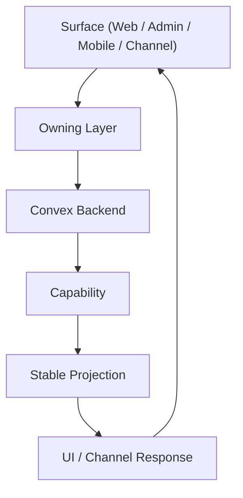
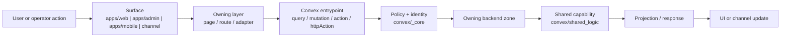
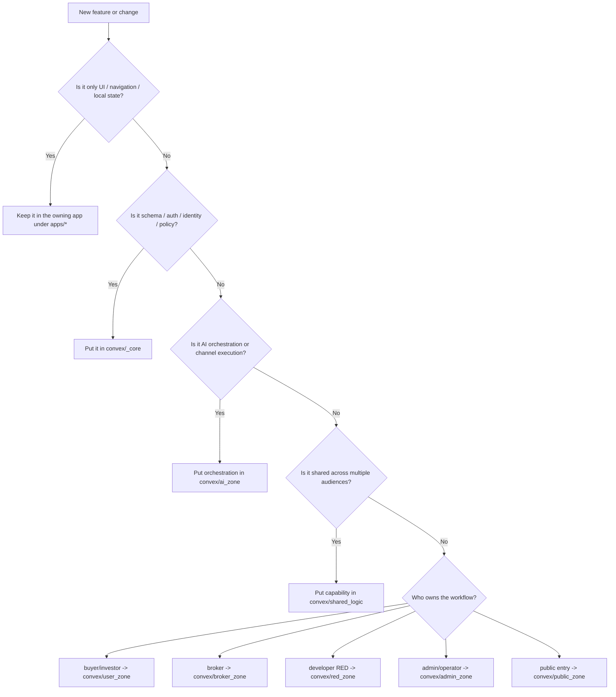

# Anan AI

Anan is a multi-surface real estate infrastructure built around one shared Convex backend. It connects buyers and investors, brokers, and developers (RED) through a single system for data, permissions, workflows, and AI-assisted distribution.

This repository is the implementation of that platform. The core idea is simple:

**surfaces collect intent -> owners translate it -> Convex executes capability -> stable projections update UI and channels**

That mental model matters more than any individual folder. If you are new to the repo, start here before you start reading feature code.

Private / closed-source / proprietary. See `LICENSE` and `NOTICE.md`.

## Platform Purpose

Anan is designed to unify the full real estate operating loop inside one architecture:

- buyers and investors express demand through AI-first and app-based entry points
- brokers distribute inventory, collaborate, and manage pipelines
- developers (RED) publish projects and offers, track demand, and coordinate execution
- platform operators manage trust, quality, policy, and internal operations

The platform is not just a listing site, not just a CRM, and not just an assistant. It is shared infrastructure for discovery, qualification, distribution, collaboration, and execution.

## Main Actors

- Users: buyers and investors searching, comparing, qualifying, and moving toward handoff
- Brokers: operators of pipelines, client follow-up, project matching, and collaboration
- Developers (RED): project owners managing inventory, offers, broker access, and performance
- Platform/Admin: operators responsible for governance, tooling, analytics, and support

Every meaningful architecture decision in this repo should be understandable through that four-party system.

## Runtime Surfaces

The repo contains a few different runtime surfaces, but they all depend on the same backend truth.

### Primary product surfaces

- `apps/web` - public web entry points plus broker and RED workspace experiences
- `apps/admin` - internal operations console
- `apps/mobile` - buyer-facing mobile app
- channel and assistant entry points backed by `convex/ai_zone`

### Supporting surfaces in this repo

- `apps/client-web` - dedicated client-facing web flows
- `apps/docs` - documentation site
- `apps/private-docs` - private documentation surface
- `apps/main-assistant` - assistant-related app workspace

The important rule is that surfaces are not allowed to become independent business systems. They are delivery layers over shared capabilities.

## Architecture Model

Anan is organized around ownership boundaries. A surface can render, collect input, and orchestrate a user flow, but it should not become the source of truth for domain rules.

The platform model is:

**Surface -> owning layer -> Convex -> capability -> projection -> UI**

- Surface: a web page, mobile screen, admin console, or channel entry point
- Owning layer: the app or zone adapter responsible for translating UI intent into backend calls
- Convex: the system of record for schema, auth, access policy, business logic, orchestration, and projections
- Capability: shared domain behavior such as offers, projects, inbox, search, CRM, or AI workflows
- Projection: stable query shapes optimized for the consuming surface
- UI: the surface re-renders from projection updates instead of inventing parallel state models



In practice this means:

- route files and pages stay thin
- shared business logic is centralized once
- access policy lives with backend truth, not in scattered UI conditions
- projections are designed intentionally for the consuming surface
- new channels should reuse the same domain capabilities instead of forking logic

### End-to-end request flow

This is the default feature path when code is written correctly:



The important constraint is that the surface starts the flow, but the backend owns the rule.

## Why Convex Is the Center

Convex is not just the database layer in this repo. It is the operational center of the platform.

It owns:

- schema and persistence
- authentication and access policy
- shared business capabilities
- AI orchestration and assistant actions
- channel ingress such as HTTP and OAuth flows
- real-time projections consumed by apps and assistants

That is why most architecture questions eventually reduce to: which backend zone should own this capability, and what projection should the surface consume?

## Backend Zones

The backend is split into explicit ownership zones. These are not cosmetic folders; they are decision boundaries.

### `convex/_core`

Foundation for the whole platform:

- schema
- identity and auth
- access policy
- shared infrastructure and platform-level primitives

If something defines universal rules or platform-wide invariants, it likely belongs here.

### `convex/shared_logic`

Shared business capabilities used across surfaces and roles:

- offers
- properties
- market
- agencies
- inbox-related capabilities
- reusable workflows and domain services

If the same behavior should exist once for multiple surfaces, put it here instead of duplicating it in a role-specific zone.

### `convex/ai_zone`

AI and assistant orchestration:

- agent orchestration
- tool-enabled assistant flows
- channel adapters
- prompt and retrieval workflows

This zone owns AI execution logic, not the entire product domain. It should compose shared capabilities rather than replace them.

### `convex/user_zone`

Buyer and investor-facing behavior:

- user-facing mobile and channel flows
- user projections and actions
- consumer-side search and interaction patterns

If a workflow is specifically about the end-user experience rather than shared domain rules, it belongs here.

### `convex/admin_zone`

Internal operations and governance:

- operational dashboards
- internal tools
- admin projections
- moderation, verification, and support workflows

This zone exists to operate the platform, not to duplicate broker or RED product logic.

### `convex/broker_zone`

Broker-scoped behavior and views:

- broker workflows
- broker-specific projections
- broker adapters into shared capabilities

This zone should hold broker-owned entry points and composition, while reusable business logic still lives in `shared_logic`.

### `convex/red_zone`

Developer (RED) behavior and views:

- project and offer management entry points
- RED-specific projections
- developer-scoped adapters around shared capabilities

If a flow is specifically about how developers operate inside the platform, this is the likely home.

### `convex/public_zone`

Unauthenticated and public entry flows:

- public-facing entry points
- auth-adjacent public flows
- surface-safe unauthenticated access patterns

This zone is for public access and entry, not for privileged business workflows.

## Zone Ownership Map

Use this as the fast answer to "who should do this work?" when you are writing code.

| Need | Owning zone / layer | Why |
| --- | --- | --- |
| Schema, auth, identity normalization, access rules | `convex/_core` | These are platform invariants |
| Shared business rules used by multiple audiences | `convex/shared_logic` | The capability should exist once |
| AI orchestration, tool use, channel assistant behavior | `convex/ai_zone` | This is assistant execution logic |
| Buyer/investor-specific product behavior | `convex/user_zone` | User flows have their own entrypoints and projections |
| Broker-specific workflows or broker-facing projections | `convex/broker_zone` | Broker ownership belongs here |
| Developer (RED)-specific workflows or projections | `convex/red_zone` | RED operations belong here |
| Admin-only operations, moderation, internal tooling | `convex/admin_zone` | Platform operation stays isolated |
| Public pages, public auth flows, unauthenticated entry | `convex/public_zone` | Public access has different constraints |
| UI rendering, navigation, local interaction state | `apps/*` | Surfaces deliver the experience, not domain truth |
| Stable reusable cross-surface system | `packages/*` | Only when the abstraction is durable |

## Repo Map

A fast way to understand where work belongs:

- `apps/` - runtime surfaces and UI delivery layers
- `convex/` - backend truth, policy, orchestration, and projections
- `packages/` - stable shared systems with durable APIs
- `docs/` - handbook, architecture references, and developer guides
- `shared/` - cross-cutting local utilities that are not yet independent packages
- `scripts/` - repo automation and local workflows

Use `packages/*` only for stable shared systems. Large code does not automatically belong in a package. If ownership is still local to one app or one backend zone, keep it local and improve the architecture there.

## Where Different Kinds of Work Belong

- New domain capability reused by multiple roles: `convex/shared_logic`
- Role-specific backend entry point or projection: the matching role zone
- Platform-wide auth, schema, or policy rule: `convex/_core`
- AI orchestration or channel execution: `convex/ai_zone`
- Surface-specific rendering and interaction: the owning app under `apps/`
- Durable cross-surface system with stable public APIs: `packages/`

If you are unsure, the safest question is not "where can I make this work?" but "who should own this behavior long-term?"

## Who Should Do What When Writing Code

When you start a feature, choose the owner before you write implementation code.

### 1. Start with the audience

- If the change is mainly for buyers or investors, start by checking `user_zone`
- If it is mainly for brokers, start by checking `broker_zone`
- If it is mainly for developers (RED), start by checking `red_zone`
- If it is mainly for platform staff or internal operations, start by checking `admin_zone`
- If it is public-facing or unauthenticated, start by checking `public_zone`
- If it is assistant or channel execution, start by checking `ai_zone`

### 2. Ask whether the rule is shared

- If the rule will be reused by more than one audience, move the business logic into `convex/shared_logic`
- If the rule defines security, schema, or identity, move it down into `convex/_core`
- If the logic is only presentation or navigation, keep it in the surface app

### 3. Keep each layer doing its job

- `apps/*` should render screens, manage local interaction, and call backend entrypoints
- role zones should expose audience-specific entrypoints and projections
- `shared_logic` should contain reusable domain capabilities
- `_core` should enforce foundational rules
- `ai_zone` should orchestrate AI behavior by calling shared capabilities instead of reimplementing them

### 4. Avoid these ownership mistakes

- Do not put shared business rules directly in `apps/*`
- Do not put broker-only or RED-only behavior straight into `shared_logic`
- Do not put product-specific domain logic into `_core`
- Do not let `ai_zone` become a second backend with copied business rules
- Do not create a package just because a folder is getting large

### Writing-code decision chart



### Real examples

- Adding a broker-only dashboard projection: `convex/broker_zone`
- Adding offer matching reused by broker, RED, and assistant flows: `convex/shared_logic`
- Adding a WhatsApp-specific assistant action: `convex/ai_zone`
- Adding a new auth redirect rule: `convex/_core`
- Adding a mobile-only screen state improvement: `apps/mobile`

## How To Work In This Repo

Read these in order when you are orienting yourself:

1. `ARCHITECTURE.md` for the platform architecture and non-negotiable standards
2. `CONVEX_RULES.md` for backend patterns, Convex rules, and channel-handler guidance
3. `docs/handbook/README.md` for the handbook index by domain and surface

Then inspect the nearest local `README.md` for the area you are about to change.

## Local Setup

### Install dependencies

```bash
pnpm install
```

### Configure auth redirects

Google OAuth and related redirects rely on environment configuration:

- `SITE_URL` - primary public web origin after sign-in
- `ANAN_WEB_URL` - optional explicit web origin
- `ANAN_ADMIN_URL` - admin app origin
- `ANAN_MOBILE_URL` - mobile app origin
- `ANAN_AUTH_ALLOWED_ORIGINS` - optional comma-separated extra safe redirect origins

### Common development commands

```bash
pnpm dev
pnpm dev:all
pnpm dev:web
pnpm dev:admin
pnpm mobile:dev
```

What they do:

- `pnpm dev` - run Convex development mode
- `pnpm dev:all` - run backend, web, and admin together
- `pnpm dev:web` - run the web app
- `pnpm dev:admin` - run the admin app
- `pnpm mobile:dev` - run the mobile app from `apps/mobile`

Other useful workflows:

```bash
pnpm dev:client-web
pnpm dev:docs
pnpm dev:private-docs
pnpm typecheck
pnpm test:once
pnpm build
```

## Documentation Map

Use these when you need deeper context:

### Core architecture

- `ARCHITECTURE.md` - platform architecture and coding standards
- `CONVEX_RULES.md` - backend rules for queries, mutations, actions, and handlers
- `docs/handbook/README.md` - handbook entry point

### Handbook by area

- `docs/handbook/convex/README.md` - backend mental model and zone guidance
- `docs/handbook/convex/ai-zone/README.md` - AI zone details
- `docs/handbook/web/README.md` - web architecture and gateway rules
- `docs/handbook/admin/README.md` - admin app guidance
- `docs/handbook/mobile/README.md` - mobile handbook index
- `docs/handbook/mobile/architecture.md` - mobile architecture flow
- `docs/handbook/security/README.md` - auth and security patterns
- `docs/handbook/llm/README.md` - LLM-oriented guidance

### Repo truth and working guides

- `docs/codebase-knowledge-base.md` - current codebase map by area
- `docs/developer-system-guide.md` - local setup and workflow notes
- `docs/llm-data-access-guide.md` - safe LLM access patterns

## Quick Rules

- Keep routes, controllers, and page entry points thin
- Respect zone boundaries and avoid deep cross-zone imports
- Put shared business logic in `convex/shared_logic` once
- Treat Convex as the source of truth for policy and capability
- Design projections intentionally for their consuming surfaces
- Package only stable shared systems, not just large folders
- Prefer architecture that can support multiple channels without duplicated logic
