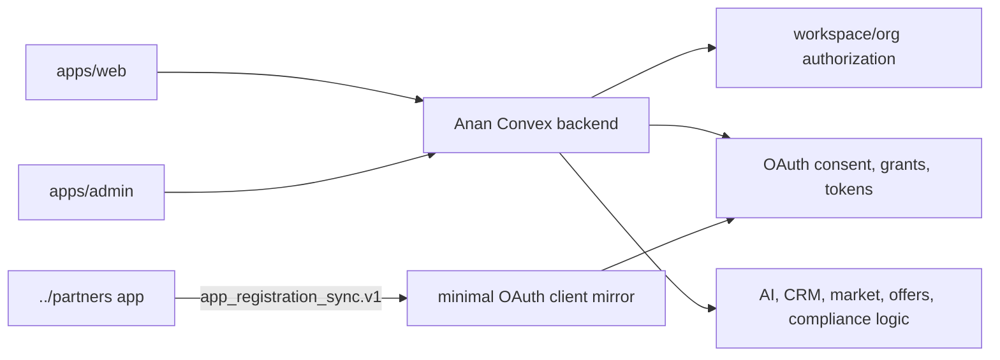
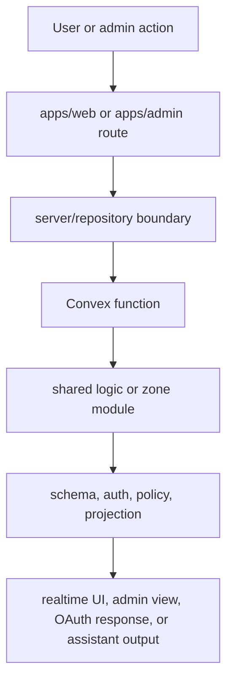

# Anan

Anan is the core workspace, authorization, operations, and AI backend for the real estate platform. It owns the Anan product surfaces, the shared Convex backend, workspace/org permissions, OAuth runtime grants, and the internal admin console.

Private, closed-source, and proprietary. See `LICENSE` and `NOTICE.md`.

## What This Repo Is

This repo is the Anan platform core:

- `apps/web` - main Next.js product surface for public entry points, sign-in, workspaces, OAuth consent, and workspace flows.
- `apps/admin` - internal Next.js operations console for platform administration.
- `convex/` - shared Convex backend for auth, data, policy, AI workflows, OAuth runtime, workspace authorization, and live projections.
- `packages/` - shared TypeScript packages for auth, authorization, domain contracts, UI, testing, web foundations, and domain logic.

The independent Partners developer portal now lives outside this repo at `../partners`. Partners owns developer/programmer accounts, programmer organizations, app registration lifecycle, reviews, app secrets, partner events, and portal audit logs. Anan only stores the minimal OAuth client mirror needed to authorize workspace access.

## Current Repo Shape



## Product Boundaries

Anan owns:

- workspace and organization authorization
- Better Auth runtime for Anan users and admins
- OAuth authorize, consent, token, and grant flows
- external OAuth client mirror validation
- workspace-side actions and permission checks
- core real estate data, offers, CRM, compliance, market, and AI workflows
- admin analytics, diagnostics, and operations

Partners owns:

- developer/programmer portal auth
- programmer profiles and programmer organizations
- partner app records, credentials, reviews, lifecycle state, and audit logs
- app registration sync payload generation
- outbound/inbound integration event logs for communication with Anan

Cross-app communication must go through explicit integration contracts and service tokens. Do not import generated Convex APIs across the Anan/Partners boundary.

## Runtime Flow



## Monorepo Map

### Apps

- `apps/web` - main Anan web app.
- `apps/admin` - internal admin console.

### Backend

- `convex/_core` - schema, auth, OAuth, security, and platform foundations.
- `convex/betterAuth` - Anan Better Auth component schema and runtime integration.
- `convex/shared_logic` - reusable domain capabilities for CRM, market, offers, projects, integrations, content, notifications, verifications, and OAuth.
- `convex/ai_zone` - assistant orchestration, channels, agents, and workflows.
- `convex/broker_zone` - broker-scoped backend adapters.
- `convex/red_zone` - developer-scoped backend adapters.
- `convex/admin_zone` - admin operations and internal views.
- `convex/public` - unauthenticated public entry flows.

### Packages

- `packages/auth` - Anan auth primitives and server helpers.
- `packages/auth-sdk` - SDK surface for OAuth/client authorization.
- `packages/authorization` - shared authorization contracts and React helpers.
- `packages/auth-client` - auth clients for web/admin usage.
- `packages/domain-contracts` - stable domain types and contracts.
- `packages/platform-core` - platform utilities, errors, classnames, and shared primitives.
- `packages/web-foundation` - common Next.js/web route and session helpers.
- `packages/ui` - shared UI components.
- `packages/testing` - test helpers and fixtures.
- `packages/*-logic` - domain logic packages for base, market, CRM, offers, workspace, and compliance.
- `packages/location-map` - location/map utilities.
- `packages/ag-ui` - structured agent UI primitives.

## OAuth And Partners Boundary

The root Partners app syncs runtime app metadata into Anan through the app registration contract. Anan stores only the mirror fields needed by OAuth:

- client id
- optional secret hash
- display metadata
- redirect URIs
- allowed scopes
- trusted/active flags
- client type
- timestamps

The sync token is `ANAN_APP_REGISTRATION_SYNC_TOKEN`. Anan OAuth flows use this mirror for client validation, redirect validation, scope validation, consent, grants, and token exchange. App reviews, developer orgs, app lifecycle state, portal audit logs, and developer auth do not belong in Anan.

## Core Stack

- Backend: Convex
- Web apps: Next.js App Router
- Auth: Better Auth with Convex integration
- Language: TypeScript
- Testing: Vitest, Playwright where app-level browser coverage exists
- Package manager: pnpm

## Quick Start

### Install

```bash
pnpm install
```

### Run Locally

```bash
pnpm dev         # Convex backend
pnpm dev:web     # apps/web on http://localhost:3000
pnpm dev:admin   # apps/admin on http://localhost:3001
pnpm dev:all     # Convex + web + admin
```

### Build And Test

```bash
pnpm typecheck
pnpm test:once
pnpm build
```

Deeper verification:

```bash
pnpm test:deep:fast
pnpm test:deep:surfaces
pnpm test:deep:e2e
pnpm test:deep:build
pnpm test:deep
pnpm test:deep:exhaustive
```

## Environment Direction

Use local env files only for local development. Do not commit `.env`, `.env.local`, `.env.*.local`, `.next/`, `node_modules/`, or build/cache output.

Common Anan environment areas:

- Convex deployment and site URLs
- Better Auth secrets and trusted origins
- Anan web/admin URLs
- OAuth redirect origins
- `ANAN_APP_REGISTRATION_SYNC_TOKEN` for trusted external app mirror sync

Check `apps/web/README.md`, `apps/admin/README.md`, and `.env.example` for app-specific setup.

## Important Commands

```bash
pnpm --filter web dev
pnpm --filter admin dev
pnpm --filter web build
pnpm --filter admin build
pnpm --filter admin test
pnpm gates
pnpm test:e2e:web
pnpm admin:bootstrap-password
```

## Architecture Rules

If you are changing architecture-sensitive code:

1. Read `ARCHITECTURE.md`.
2. Read `CONVEX_RULES.md`.
3. Use the nearest package or app `README.md`.
4. Keep surfaces thin and push durable business behavior into the owning package, server boundary, or Convex module.
5. Keep Partners-owned data out of Anan.
6. Keep Anan workspace authorization and OAuth grants inside Anan.

## Useful Entry Points

- [Architecture standards](./ARCHITECTURE.md)
- [Convex rules](./CONVEX_RULES.md)
- [Web app](./apps/web/README.md)
- [Admin app](./apps/admin/README.md)
- [Audit scripts](./scripts/audit/README.md)
- [AG UI package](./packages/ag-ui/README.md)
- [Auth package](./packages/auth/README.md)
- [Authorization package](./packages/authorization/README.md)
- [Domain contracts](./packages/domain-contracts/README.md)
- [Web foundation](./packages/web-foundation/README.md)
- [UI package](./packages/ui/README.md)

## Mental Model

Anan is the source of truth for workspace execution, authorization, consent, grants, and platform operations. The Partners app is a separate developer portal that asks Anan for workspace access through explicit contracts instead of sharing internal database ownership.
