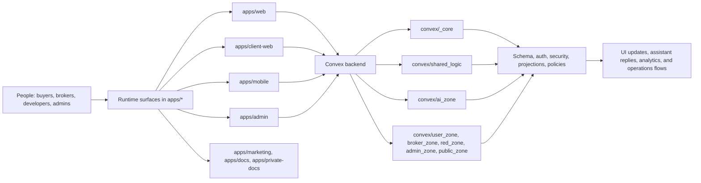
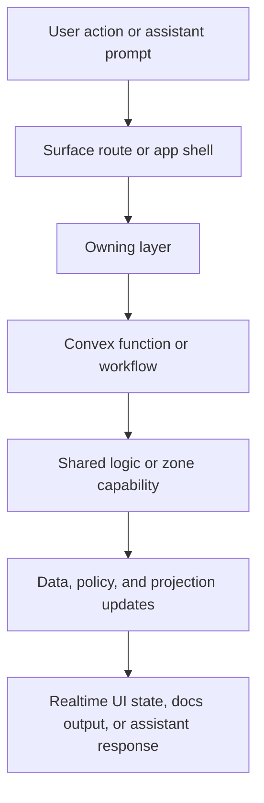

# Anan

Anan is a multi-surface real estate platform built around one shared Convex backend.
It connects buyers, brokers, developers, platform operators, and AI workflows inside a single operating system instead of scattering them across separate tools.

Private, closed-source, and proprietary. See `LICENSE` and `NOTICE.md`.

## What This Repo Is

This repository is the full product stack for Anan:

- buyer-facing experiences across web, mobile, and conversational channels
- broker and developer workspaces
- an internal admin console
- public and private documentation surfaces
- shared UI systems and AI interaction primitives
- a Convex backend that owns data, policy, orchestration, and live projections

## Repo Overview



## Request Lifecycle



## Monorepo Map

### Apps

- `apps/web` - main Next.js surface for the public site and broker/developer workspace
- `apps/client-web` - standalone buyer-facing Next.js experience
- `apps/mobile` - Expo app for buyers
- `apps/admin` - internal operations console
- `apps/marketing` - public marketing surface
- `apps/docs` - public integration and developer docs
- `apps/private-docs` - internal handbook and audit portal

### Packages

- `packages/ag-ui` - reusable UI primitives for structured agent turns
- `packages/client-assistant` - shared client assistant package surface

### Backend

- `convex/_core` - schema, auth, security, foundation
- `convex/shared_logic` - reusable domain capabilities
- `convex/ai_zone` - assistant orchestration, channels, agent teams, workflows
- `convex/user_zone` - buyer-facing endpoints for web, mobile, and WhatsApp
- `convex/broker_zone` - broker-scoped backend adapters
- `convex/red_zone` - developer-scoped backend adapters
- `convex/admin_zone` - admin operations and internal views
- `convex/public_zone` - unauthenticated entry flows

### Docs And Rules

- `ARCHITECTURE.md` - repo-wide architecture standards
- `CONVEX_RULES.md` - backend rules for Convex design
- `docs/handbook` - deep handbook by surface and domain
- app-level `README.md` files - local setup and subsystem notes

## Product Shape

Anan is designed as shared infrastructure for a real estate network:

- buyers discover and qualify through AI-first flows across web, mobile, and chat surfaces
- brokers work inside a live workspace with CRM, offers, projects, and collaboration tools
- developers publish projects, manage offers, and monitor demand and partner activity
- admins operate the platform, knowledge base, diagnostics, and internal systems
- docs surfaces support both external integrations and internal team onboarding

That shared product model is why the repo is organized around ownership boundaries and backend capabilities instead of per-page duplication.

## How The Architecture Thinks

Anan is organized around ownership boundaries, not random folder growth.

- surfaces stay thin and delegate to owning layers
- Convex is the source of truth for data, policy, orchestration, and real-time delivery
- shared domain behavior lives once in `convex/shared_logic`
- AI is a first-class backend capability, not a bolt-on widget
- packages are reserved for stable shared systems, not just large folders

If you are changing architecture-sensitive code, read `ARCHITECTURE.md` first.

## Core Stack

- backend: Convex
- web surfaces: Next.js App Router
- mobile: Expo Router
- language: TypeScript across the stack
- shared UI: workspace packages such as `@anan/ag-ui`

## Quick Start

### Install

```bash
pnpm install
```

### Read this first

- [Architecture rules](./ARCHITECTURE.md)
- [Convex rules](./CONVEX_RULES.md)
- [Handbook index](./docs/handbook/README.md)

### Required environment direction

At minimum, local development usually needs:

- a Convex deployment URL for the surface you are running
- app-specific env files such as `apps/web/.env.local` or `apps/client-web/.env.local`
- OAuth redirect origins when testing sign-in flows

Common root-level redirect vars:

- `SITE_URL`
- `ANAN_WEB_URL`
- `ANAN_ADMIN_URL`
- `ANAN_MOBILE_URL`
- `ANAN_AUTH_ALLOWED_ORIGINS`

Check each app README for the exact env contract.

### Run locally

```bash
pnpm dev                # Convex
pnpm dev:all            # Convex + web + client-web + marketing + admin
pnpm dev:web            # web app on http://localhost:3000
pnpm dev:client-web
pnpm dev:marketing
pnpm dev:admin          # admin app on http://localhost:3001
pnpm dev:docs
pnpm dev:private-docs
pnpm mobile:dev
```

### Build and test

```bash
pnpm build
pnpm test:once
pnpm test:deep
pnpm test:deep:exhaustive
```

## Verification Tiers

- `pnpm test:deep:fast` - core deterministic checks
- `pnpm test:deep:surfaces` - app-local non-browser suites
- `pnpm test:deep:e2e` - stable browser coverage
- `pnpm test:deep:build` - full build verification
- `pnpm test:deep:optional` - setup-dependent browser scenarios
- `pnpm test:deep` - fast + surfaces + e2e
- `pnpm test:deep:exhaustive` - deepest verification pass

## Docs Index

### Repo rules

- [Architecture standards](./ARCHITECTURE.md)
- [Convex rules](./CONVEX_RULES.md)
- [Developer system guide](./docs/developer-system-guide.md)
- [Codebase knowledge base](./docs/codebase-knowledge-base.md)
- [LLM data access guide](./docs/llm-data-access-guide.md)

### Handbook

- [Handbook index](./docs/handbook/README.md)
- [Convex handbook](./docs/handbook/convex/README.md)
- [Web handbook](./docs/handbook/web/README.md)
- [Admin handbook](./docs/handbook/admin/README.md)
- [Mobile handbook](./docs/handbook/mobile/README.md)
- [Security handbook](./docs/handbook/security/README.md)
- [LLM handbook](./docs/handbook/llm/README.md)
- [Glossary](./docs/handbook/glossary.md)

### Deep-dive docs

- [Convex AI zone](./docs/handbook/convex/ai-zone.md)
- [Convex zones](./docs/handbook/convex/zones.md)
- [Convex shared logic](./docs/handbook/convex/shared-logic.md)
- [Web server gateway](./docs/handbook/web/server-gateway.md)
- [Web SSR and performance](./docs/handbook/web/ssr-performance.md)
- [Mobile architecture](./docs/handbook/mobile/architecture.md)
- [Security authorization](./docs/handbook/security/authorization.md)
- [Web authorization flow](./docs/handbook/security/web-authorization-flow.md)

### Recipes

- [Add an agent](./docs/handbook/recipes/add-agent.md)
- [Add a channel](./docs/handbook/recipes/add-channel.md)
- [Add a table](./docs/handbook/recipes/add-table.md)
- [Add a web domain](./docs/handbook/recipes/add-web-domain.md)

## Useful Entry Points

### App docs

- [Web app](./apps/web/README.md)
- [Client web app](./apps/client-web/README.md)
- [Admin app](./apps/admin/README.md)
- [Admin deploy guide](./apps/admin/DEPLOY.md)
- [Mobile app](./apps/mobile/README.md)
- [Docs app](./apps/docs/README.md)
- [Private docs app](./apps/private-docs/README.md)
- [Client zone notes](./apps/client-web/client_zone/README.md)
- [Web server gateway](./apps/web/server/README.md)

### Package docs

- [AG UI package](./packages/ag-ui/README.md)

## Start Here If You Are New

1. Read [ARCHITECTURE.md](./ARCHITECTURE.md).
2. Read [CONVEX_RULES.md](./CONVEX_RULES.md).
3. Open [docs/handbook/README.md](./docs/handbook/README.md).
4. Jump into the app or backend zone you are changing.
5. Use the nearest local `README.md` before changing subsystem structure.

## Mental Model In One Line

Anan is not just a website, CRM, or chatbot. It is a shared real estate infrastructure where every surface plugs into the same backend truth.
