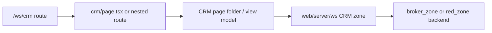

# Workspace UI Zone: `crm`

## Ownership And Purpose
This zone owns the CRM experience under `/ws/crm`: route layout, top-level route tabs, client/deal list/detail pages, and CRM-specific view-model/types for workspace users.

## Why This Zone Exists
CRM routes need one place to assemble client/deal UI without mixing route wiring, workspace chrome, and domain shaping into unrelated zones. The backend ownership still lives in `apps/web/server/ws` and the owner zones; this folder owns the route-facing UI composition.

## Architecture Overview
- `page.tsx`, `layout.tsx`, `loading.tsx`: route entrypoints
- `CrmPage/`, `ClientsPage/`, `ClientDetailPage/`, `PipelinePage/`: page-level UI orchestrators
- `crmViewModel.ts`, `crmTypes.ts`: route-facing mapping/types
- `CrmRouteTabs.tsx`: zone navigation UI
- nested `clients/` and `brokers/` routes for focused CRM flows

## Flowchart

## Stable Entrypoints
- `page.tsx`
- `layout.tsx`
- `CrmPage/index.tsx`
- `ClientsPage/index.tsx`
- `ClientDetailPage/index.tsx`
- `crmViewModel.ts`

## Outside-In Usage
Use this zone from workspace route code only. If another UI zone needs CRM data, it should call the server layer or a shared UI primitive, not import random CRM page internals. Treat the page folders and view-model/types files as the stable local entrypoints.

## Allowed And Forbidden Imports
- Allowed: shared workspace UI, `apps/web/server/ws`, zone-local page folders and view models
- Forbidden: direct cross-imports from other route zones when a shared component or server contract is the correct dependency
- Forbidden: route files doing backend orchestration inline

## Dependency Map
- Upstream consumers: `/ws/crm`, `/ws/crm/clients/*`, `/ws/crm/brokers/*`
- Downstream dependencies: `apps/web/server/ws`, shared workspace UI, local page folders

## Common Extension Tasks
- Add a new CRM sub-route: keep the route file thin and place the real UI in a local page folder
- Add derived UI state: prefer `crmViewModel.ts` or page-local helpers over inline page logic
