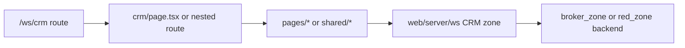

# Workspace UI Zone: `crm`

## Ownership And Purpose
This zone owns the CRM experience under `/ws/crm`: route layout, top-level route tabs, client/deal list/detail pages, and CRM-specific view-model/types for workspace users.

## Why This Zone Exists
CRM routes need one place to assemble client/deal UI without mixing route wiring, workspace chrome, and domain shaping into unrelated zones. The backend ownership still lives in `apps/web/server/ws` and the owner zones; this folder owns the route-facing UI composition.

## Architecture Overview
- route files stay at the zone root and nested route folders
- `pages/CrmPage`, `pages/ClientsPage`, `pages/ClientDetailPage`, `pages/PipelinePage`: page-level UI orchestrators
- `shared/navigation`: zone navigation UI
- `shared/forms`: shared CRM form UI
- `shared/lib`: route-facing mapping helpers
- `types`: route-facing CRM types
- nested `clients/` and `brokers/` routes for focused CRM flows

## Flowchart

## Stable Entrypoints
- `page.tsx`
- `layout.tsx`
- `pages/CrmPage/index.tsx`
- `pages/ClientsPage/index.tsx`
- `pages/ClientDetailPage/index.tsx`
- `shared/lib/crmViewModel.ts`
- `types/crmTypes.ts`

## Outside-In Usage
Use this zone from workspace route code only. Treat `pages/`, `shared/`, and `types/` as the stable local entrypoints. Other UI zones should call the server layer or a true shared UI primitive, not CRM page internals.

## Allowed And Forbidden Imports
- Allowed: shared workspace UI, `apps/web/server/ws`, local `pages/`, local `shared/`, local `types/`
- Forbidden: direct cross-imports from other route zones when a shared component or server contract is the correct dependency
- Forbidden: `shared/` importing from `pages/`
- Forbidden: route files doing backend orchestration inline

## Dependency Map
- Upstream consumers: `/ws/crm`, `/ws/crm/clients/*`, `/ws/crm/brokers/*`
- Downstream dependencies: `apps/web/server/ws`, shared workspace UI, CRM-local shared helpers

## Common Extension Tasks
- Add a new CRM sub-route: keep the route file thin and place the real UI in a local page folder
- Add derived UI state: prefer `shared/lib/crmViewModel.ts` or page-local helpers over inline page logic
