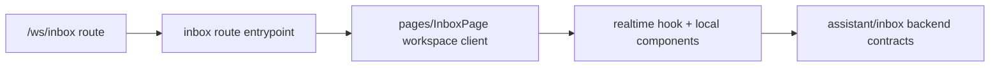

# Workspace UI Zone: `inbox`

## Ownership And Purpose
This zone owns the workspace inbox experience under `/ws/inbox`: thread list/detail routing, realtime workspace inbox client state, composer, collaboration cards, and inbox-specific UI helpers.

## Why This Zone Exists
Inbox is interaction-heavy and stateful. It needs a dedicated route zone so realtime logic, composer behavior, and thread presentation stay localized instead of leaking into generic workspace code.

## Architecture Overview
- `page.tsx`, `layout.tsx`, `loading.tsx`: route entrypoints
- `pages/InboxPage`: main workspace inbox client, thread view, realtime hooks, and local components
- `[conversationId]/page.tsx`: focused detail route wrapper

## Flowchart

## Stable Entrypoints
- `page.tsx`
- `layout.tsx`
- `pages/InboxPage/InboxWorkspaceClient.tsx`
- `pages/InboxPage/useRealtimeInbox.ts`
- `pages/InboxPage/InboxThreadView.tsx`

## Outside-In Usage
Use this zone from workspace inbox routes only. If another zone needs conversation or assistant data, go through the server/backend contract or extract a true shared UI primitive. Do not import the inbox workspace client or composer directly into unrelated zones.

## Allowed And Forbidden Imports
- Allowed: shared workspace UI, assistant/inbox contracts, local realtime hooks and components
- Forbidden: other zones importing inbox-local interactive components as shared widgets
- Forbidden: route files owning long-lived realtime logic inline

## Dependency Map
- Upstream consumers: `/ws/inbox` and `/ws/inbox/[conversationId]`
- Downstream dependencies: inbox workspace client, realtime hooks, local components, assistant/inbox backend contracts

## Common Extension Tasks
- Add inbox UI behavior: keep it under `pages/InboxPage/`
- Add derived inbox state: prefer the existing realtime hook or a new local hook over inline route logic
