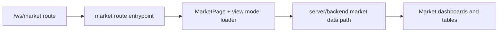

# Workspace UI Zone: `market`

## Ownership And Purpose
This zone owns the workspace market experience under `/ws/market`: overview, areas, cities, opportunities, and research tabs, plus market-specific view-model shaping and filters.

## Why This Zone Exists
Market is a presentation-heavy workspace zone with multiple views over shared market data. This folder keeps the route wiring and market UI composition local while the data orchestration stays in server/backend layers.

## Architecture Overview
- `page.tsx`, `layout.tsx`: route entrypoints
- `MarketPage/`: primary market page module and tab UI
- `loadMarketPageModel.ts`, `marketViewModel.ts`, `marketTypes.ts`: route-facing data shaping
- `MarketRouteTabs.tsx`: route navigation UI
- `areas/`, `cities/`, `opportunities/`, `research/`: focused route trees

## Flowchart

## Stable Entrypoints
- `page.tsx`
- `MarketPage/index.tsx`
- `loadMarketPageModel.ts`
- `marketViewModel.ts`
- `marketTypes.ts`

## Outside-In Usage
Use this zone from workspace market routes only. If another zone needs market business data, use the server/backend contract instead of importing MarketPage internals. If another zone needs a generic chart/table primitive, extract it intentionally rather than coupling to a market page component.

## Allowed And Forbidden Imports
- Allowed: shared workspace UI, route-local market components, server/backend market loaders
- Forbidden: unrelated route zones importing market page components as shared building blocks
- Forbidden: market route files owning backend orchestration directly

## Dependency Map
- Upstream consumers: `/ws/market` and nested market routes
- Downstream dependencies: market page model loader, server/backend market contracts, local table/chart components

## Common Extension Tasks
- Add a new market panel: place it under `MarketPage/` and keep route files thin
- Add a new derived field or filter: start in `loadMarketPageModel.ts` or `marketViewModel.ts`
