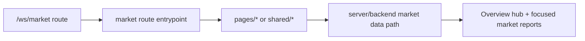

# Workspace UI Zone: `market`

## Ownership And Purpose
This zone owns the workspace market-analysis experience under `/ws/market`: one overview hub plus focused deep-link routes for cities, hot areas, market results, and keyword research.

## Why This Zone Exists
Market is a presentation-heavy workspace zone built on shared market data. This folder keeps route wiring, exact-date filters, and market-only UI composition local while the data orchestration stays in server/backend layers.

## Architecture Overview
- route files stay at the zone root and nested route folders
- `pages/MarketPage`: primary market page module and focused route panels
- `shared/navigation`: route navigation UI
- `shared/lib`: route-facing loaders and view-model shaping
- `types`: route-facing market types
- `fixtures`: mock-only development and test data
- `areas/`, `cities/`, `opportunities/`, `research/`: focused route trees

## Flowchart

## Stable Entrypoints
- `page.tsx`
- `pages/MarketPage/index.tsx`
- `shared/lib/loadMarketPageModel.ts`
- `shared/lib/marketViewModel.ts`
- `types/marketTypes.ts`

## Outside-In Usage
Use this zone from workspace market routes only. Route files should compose from `pages/`, `shared/`, `types/`, `fixtures/`, and server/backend contracts. If another zone needs market data, use the server/backend contract instead of importing `pages/MarketPage` internals.

## Allowed And Forbidden Imports
- Allowed: shared workspace UI, local `pages/`, local `shared/`, local `types/`, local `fixtures/`, server/backend market loaders
- Forbidden: `shared/` importing from `pages/`
- Forbidden: unrelated route zones importing market page components as shared building blocks
- Forbidden: market route files owning backend orchestration directly

## Dependency Map
- Upstream consumers: `/ws/market` and nested market routes
- Downstream dependencies: market page model loader, server/backend market contracts, local market report components

## Common Extension Tasks
- Add a new market panel: place it under `pages/MarketPage/` and keep route files thin
- Add a new derived field or filter: start in `shared/lib/loadMarketPageModel.ts` or `shared/lib/marketViewModel.ts`
- Add a new deep-link report: keep `/ws/market` as the overview hub and add the focused route beside the existing market routes
