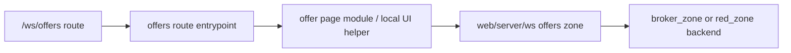

# Workspace UI Zone: `offers`

## Ownership And Purpose
This zone owns the workspace offers experience under `/ws/offers`: overview, profiles, detail, search, and create flows, plus the route-facing offer view-model helpers and local pagination/search utilities.

## Why This Zone Exists
Offers have multiple workspace sub-surfaces that share route-level types, tabs, and list/detail UI. This zone keeps that presentation structure local while delegating ownership-sensitive operations to `apps/web/server/ws`.

## Architecture Overview
- `page.tsx`, `layout.tsx`, `loading.tsx`: zone entrypoints
- `OfferOverviewPage/`, `OfferProfilesPage/`, `OfferDetailPage/`, `OfferDirectoryPage/`: page modules
- `CreateOfferForm.tsx`, `OfferCards.tsx`, `OfferPaginationNav.tsx`, `OffersTabs.tsx`: local UI primitives
- `offerViewModel.ts`, `offerTypes.ts`, `offersPageData.ts`: route-facing mapping/types/pagination helpers
- `create/`, `search/`, `[offerId]/`, `brokers/`, `developers/`: focused route trees

## Flowchart

## Stable Entrypoints
- `page.tsx`
- `OfferOverviewPage/index.tsx`
- `OfferProfilesPage/index.tsx`
- `OfferDetailPage/index.tsx`
- `CreateOfferForm.tsx`
- `offerViewModel.ts`
- `offersPageData.ts`

## Outside-In Usage
Use this zone from workspace offer routes only. If another zone needs offer business data, it should go through the server layer. If another zone needs a generic UI primitive, promote it deliberately instead of importing an offer page component directly.

## Allowed And Forbidden Imports
- Allowed: shared workspace UI, `apps/web/server/ws`, local page folders, local view models/types/helpers
- Forbidden: route files doing direct backend orchestration
- Forbidden: other route zones importing offer page internals as shared components by accident

## Dependency Map
- Upstream consumers: `/ws/offers` and all nested offer routes
- Downstream dependencies: `apps/web/server/ws`, shared workspace UI, local form/list/detail components

## Common Extension Tasks
- Add a new offer projection field: update `offerTypes.ts` and `offerViewModel.ts`
- Add route-local search/pagination behavior: keep it in `offersPageData.ts` or page-local helpers
