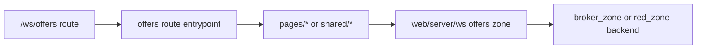

# Workspace UI Zone: `offers`

## Ownership And Purpose
This zone owns the workspace offers experience under `/ws/offers`: overview, profiles, detail, search, create, and edit flows.

## Why This Zone Exists
Offers has several route variants that share list cards, filters, types, form state, and route-facing mapping logic. This folder keeps those concerns local while delegating ownership-aware behavior to `apps/web/server/ws`.

## Architecture Overview
- route files stay at the zone root and nested route folders
- `pages/OfferOverviewPage`, `pages/OfferProfilesPage`, `pages/OfferDetailPage`, `pages/OfferDirectoryPage`: page orchestrators and page-private UI
- `shared/components`: cross-page cards and pagination controls
- `shared/forms`: cross-route offer form UI
- `shared/lib`: route-facing mapping, filtering, sorting, and pagination helpers
- `shared/copy`: offer-local copy/presentation helpers
- `types`: route-facing offer types
- `create/`, `search/`, `[offerId]/`, `brokers/`, `developers/`: focused route trees

## Flowchart

## Stable Entrypoints
- `page.tsx`
- `pages/OfferOverviewPage/index.tsx`
- `pages/OfferProfilesPage/index.tsx`
- `pages/OfferDetailPage/index.tsx`
- `shared/forms/CreateOfferForm.tsx`
- `shared/lib/offerViewModel.ts`
- `shared/lib/offersPageData.ts`
- `types/offerTypes.ts`

## Outside-In Usage
Use this zone from workspace offer routes only. Route files should compose from `pages/`, `shared/`, `types/`, and `apps/web/server/ws`. Other zones should not import offer page internals directly.

## Allowed And Forbidden Imports
- Allowed: shared workspace UI, `apps/web/server/ws`, local `pages/`, local `shared/`, local `types/`
- Forbidden: route files doing direct backend orchestration
- Forbidden: `shared/` importing from `pages/`
- Forbidden: other route zones importing offer page internals as accidental shared components

## Dependency Map
- Upstream consumers: `/ws/offers` and all nested offer routes
- Downstream dependencies: `apps/web/server/ws`, shared workspace UI, offer-local shared components and helpers

## Common Extension Tasks
- Add a new offer projection field: update `types/offerTypes.ts` and `shared/lib/offerViewModel.ts`
- Add cross-page list/filter behavior: keep it in `shared/lib/offersPageData.ts`
- Add page-private UI: keep it inside the owning `pages/*` folder
