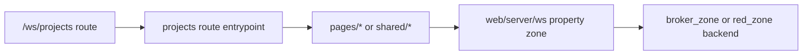

# Workspace UI Zone: `projects`

## Ownership And Purpose
This zone owns the workspace projects experience under `/ws/projects`: list, detail, create, edit, and analytics flows.

## Why This Zone Exists
Projects is the workspace-facing presentation layer for property/developer inventory. This zone keeps route wiring, shared form state, and project view-model shaping local while delegating server orchestration to `apps/web/server/ws`.

## Architecture Overview
- route files stay at the zone root and nested route folders
- `pages/ProjectsPage`, `pages/ProjectDetailPage`, `pages/ProjectAnalyticsPage`: page orchestrators and page-private UI
- `shared/forms`: shared create/edit form UI and submission helpers
- `shared/lib`: route-facing project mapping helpers
- `types`: route-facing project types
- `create/` and `[projectId]/`: focused route entrypoints for create/detail/edit/analytics

## Flowchart

## Stable Entrypoints
- `page.tsx`
- `pages/ProjectsPage/index.tsx`
- `pages/ProjectDetailPage/index.tsx`
- `pages/ProjectAnalyticsPage/index.tsx`
- `shared/forms/ProjectFormScreen.tsx`
- `shared/lib/projectViewModel.ts`
- `types/projectTypes.ts`

## Outside-In Usage
Use this zone from workspace project routes only. Route files should compose from `pages/`, `shared/`, `types/`, and `apps/web/server/ws`. Other zones should consume project data through server contracts rather than importing project page internals.

## Allowed And Forbidden Imports
- Allowed: shared workspace UI, `apps/web/server/ws`, local `pages/`, local `shared/`, local `types/`
- Forbidden: route files doing direct Convex calls or importing unrelated zone internals
- Forbidden: `shared/` importing from `pages/`
- Forbidden: scattering project form logic into other route groups

## Dependency Map
- Upstream consumers: `/ws/projects`, `/ws/projects/create`, `/ws/projects/[projectId]/*`
- Downstream dependencies: `apps/web/server/ws`, AG UI form components, shared workspace UI, project-local shared helpers

## Common Extension Tasks
- Add a new project view field: update `types/projectTypes.ts` and `shared/lib/projectViewModel.ts` first
- Add a new form behavior: keep it in `shared/forms/`
- Add page-private UI: keep it inside the owning `pages/*` folder
