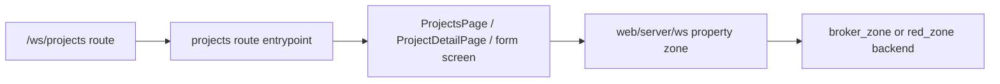

# Workspace UI Zone: `projects`

## Ownership And Purpose
This zone owns the workspace projects experience under `/ws/projects`: list, detail, create, and edit flows, plus the route-facing project view-model/type mapping.

## Why This Zone Exists
Projects are the workspace-facing presentation layer for property/developer inventory. This zone keeps route wiring and project UI composition local while delegating server orchestration to `apps/web/server/ws` and backend ownership to the relevant zones.

## Architecture Overview
- `page.tsx`, `layout.tsx`, `loading.tsx`: route entrypoints
- `ProjectsPage/`, `ProjectDetailPage/`: page modules
- `ProjectFormScreen.tsx`: form UI shared by create/edit flows
- `projectViewModel.ts`, `projectTypes.ts`: route-facing mapping/types
- `create/` and `[projectId]/` route trees: focused route entrypoints for create/detail/edit

## Flowchart

## Stable Entrypoints
- `page.tsx`
- `ProjectsPage/index.tsx`
- `ProjectDetailPage/index.tsx`
- `ProjectFormScreen.tsx`
- `projectViewModel.ts`

## Outside-In Usage
Use this zone from workspace project routes only. Other zones should consume project data through server contracts or shared UI pieces, not by importing project route internals directly. Keep route files thin and extend the page folders or `projectViewModel.ts` when adding presentation behavior.

## Allowed And Forbidden Imports
- Allowed: shared workspace UI, `apps/web/server/ws`, local page folders, local project view models/types
- Forbidden: route files doing direct Convex calls or importing unrelated zone internals
- Forbidden: scattering project form logic into other route groups

## Dependency Map
- Upstream consumers: `/ws/projects`, `/ws/projects/create`, `/ws/projects/[projectId]/*`
- Downstream dependencies: `apps/web/server/ws`, AG UI form components, shared workspace UI

## Common Extension Tasks
- Add a new project view field: update `projectTypes.ts` and `projectViewModel.ts` first
- Add a new form behavior: keep the shared UI in `ProjectFormScreen.tsx` and route files as thin wrappers
