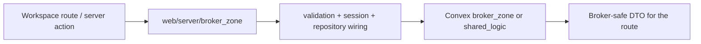

# Web Server `broker_zone`

## Ownership And Purpose
`apps/web/server/broker_zone` owns broker-facing Next.js server orchestration. It validates broker payloads, restores broker session context, composes Convex repositories, and presents a broker-safe contract to workspace routes and server actions.

## Why This Zone Exists
The web app needs a server-owned layer between route code and Convex. This zone keeps broker validation, DTO shaping, and repository wiring out of JSX while staying aligned with backend ownership rules.

## Architecture Overview
- `index.ts`: root gateway for broker server capabilities
- `overview/`: broker overview loader
- `properties/`: broker property CRUD/publish orchestration
- `offers/`: broker offer snapshot and lifecycle orchestration
- `crm/`: broker CRM orchestration
- `organizations/`: broker organization/team orchestration

## Flowchart

## Stable Entrypoints
- `index.ts`
- `overview/index.ts`
- `properties/index.ts`
- `offers/index.ts`
- `crm/index.ts`
- `organizations/index.ts`

## Outside-In Usage
Use this zone when the caller is a broker-facing web route or action. Import from `@/server/broker_zone` when you need the broker surface as a whole; keep subfolder imports for work happening inside the zone itself. If behavior is audience-agnostic across broker and developer, prefer `ws` or `shared_logic`.

## Allowed And Forbidden Imports
- Allowed: contracts, auth/session helpers, repository adapters, `convex` backend contracts through infrastructure adapters
- Allowed: `ws` composition layer as an upstream caller
- Forbidden: direct route-level Convex orchestration that skips this server layer
- Forbidden: importing `red_zone` internals for shared business rules

## Dependency Map
- Upstream consumers: `apps/web/server/ws`, broker-specific routes/actions
- Downstream dependencies: infrastructure repositories, broker Convex backend handlers, shared contracts

## Common Extension Tasks
- Add a broker server mutation: start in the relevant feature folder and keep the route file thin
- Add a reusable broker capability: expose it from `index.ts` once the feature folder contract is stable

## Related Docs
- `apps/web/server/broker_zone/ZONE_REGISTER.md`
- `apps/web/server/broker_zone/ZONE_AUDIT.md`
