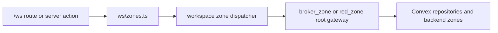

# Workspace Server Zone (`/ws`)

## Ownership And Purpose
`apps/web/server/ws` owns workspace-wide server composition for the `/ws` surface. It resolves the current audience and delegates to the correct broker or developer zone services without leaking that branching into route files.

## Why This Zone Exists
Workspace routes should not know the full broker-vs-developer backend tree. This zone is the stable composition layer that restores owner context once and exposes audience-aware CRM, offers, and property handlers.

## Architecture Overview
- `zones.ts`: public gateway for workspace zone composition
- `capabilities/`: audience-aware CRM, offers, and property dispatchers
- `session/`: workspace-scoped session resolver
- `shared/`: unavailable-zone errors and shared helpers

## Flowchart

## Stable Entrypoints
- `zones.ts`
- `session/index.ts`

## Outside-In Usage
Use `ws/zones.ts` from workspace routes and server actions that need audience-aware business behavior. Do not import individual broker or developer submodules directly from workspace route code when `ws` already owns the branching.

## Allowed And Forbidden Imports
- Allowed: `apps/web/server/broker_zone`, `apps/web/server/red_zone`, contracts, infrastructure repositories, auth/session helpers
- Forbidden: page JSX importing broker/developer server modules directly when `ws` can compose them once
- Forbidden: putting Convex branching logic directly in route files

## Dependency Map
- Upstream consumers: workspace route groups under `apps/web/app/(ws)/ws`
- Downstream dependencies: broker/red server zones, workspace contracts, Convex repositories, auth/session

## Common Extension Tasks
- Add a new audience-aware workspace capability: create a focused dispatcher under `capabilities/` and export it from `zones.ts`
- Extend owner-context handling: update `session/index.ts`

## Related Docs
- `apps/web/server/ws/ZONE_REGISTER.md`
- `apps/web/server/ws/ZONE_AUDIT.md`
- `apps/web/server/ws/capabilities/README.md`
