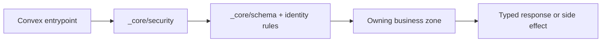

# Backend: `_core` Zone

## Ownership And Purpose
`convex/_core` owns the backend foundations that every other Convex zone depends on: schema assembly inputs, identity normalization, access policy, auth/provider wiring, and OAuth HTTP internals.

## Why This Zone Exists
Business zones should not decide global schema rules, auth policy, or identity shape on their own. `_core` keeps those platform-wide concerns centralized so `shared_logic`, owner zones, AI, and public flows all execute against the same rules.

## Architecture Overview
- `schema/`: table and index declarations grouped by domain and assembled by `convex/schema.ts`
- `security/`: access policy, auth issuer/provider helpers, delegated access, channel auth, and identity normalization
- `oauth/`: OAuth consent routing, token/jwt helpers, and HTTP adapters used by the top-level Convex router

## Flowchart

## Stable Entrypoints
- `convex/_core/schema/*` for new tables and indexes
- `convex/_core/security/accessPolicy.ts` for authorization policy
- `convex/_core/security/identity.ts` for normalized caller/session context
- `convex/_core/oauth/http.ts` for OAuth HTTP routing internals

## Outside-In Usage
Use `_core` only when you are changing a platform concern: schema, identity, auth, delegated access, or OAuth routing. If you are building a feature query, mutation, workflow, or assistant behavior, you should be in a business zone instead.

## Allowed And Forbidden Imports
- Allowed: imports from repo-level Convex entrypoints and other `_core` modules
- Allowed: narrowly shared validator/profile bridges that are already platform-level dependencies
- Forbidden: business-facing queries, mutations, actions, or feature orchestration
- Forbidden: feature-specific helpers that belong in `shared_logic` or an audience zone

## Dependency Map
- Upstream consumers: every Convex zone, `convex/schema.ts`, `convex/http.ts`, `convex/auth.ts`
- Downstream dependencies: minimal shared validators/helpers only where platform wiring currently requires them

## Common Extension Tasks
- Add a table or index: edit `schema/*`, then wire the top-level schema assembly
- Add or tighten access checks: edit `security/accessPolicy.ts` and the relevant identity helpers
- Extend OAuth routing: edit `oauth/*` and validate the corresponding HTTP route path

## Related Docs
- `convex/_core/ZONE_REGISTER.md`
- `convex/_core/ZONE_AUDIT.md`
- `docs/handbook/convex/core.md`
