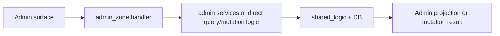

# Backend: `admin_zone`

## Ownership And Purpose
`convex/admin_zone` owns admin-only operational projections and mutations for users, organizations, properties, compliance, analytics, orders, knowledge, notifications, threads, and system maintenance tasks.

## Why This Zone Exists
Admin needs broad operational visibility and control that should not leak into broker, developer, or buyer surfaces. This zone keeps those privileged read models and operational mutations isolated behind admin-only access.

## Architecture Overview
- Root feature handlers such as `users.ts`, `organizations.ts`, `properties.ts`, `overview.ts`, `analytics.ts`, `verifications.ts`
- Focused operational handlers such as `orders.ts`, `banks.ts`, `knowledge.ts`, `threads.ts`, `notifications.ts`
- `services/`: admin-internal helpers for user/property operations

## Flowchart

## Stable Entrypoints
- Root feature files such as `users.ts`, `organizations.ts`, `properties.ts`, `overview.ts`, `analytics.ts`
- `services/usersService.ts`
- `services/propertiesService.ts`

## Outside-In Usage
Use `admin_zone` only for admin-optimized projections or operations. Other zones should not import admin handlers to avoid accidentally coupling themselves to privileged read models. If behavior is reusable across non-admin callers, move it to `shared_logic`.

## Allowed And Forbidden Imports
- Allowed: `_core`, `shared_logic`, local services
- Allowed: admin app/server consumers and tests
- Forbidden: broker/developer/user/public flows depending on admin-only handlers
- Forbidden: cross-zone deep imports when the ownership is actually shared business logic

## Dependency Map
- Upstream consumers: admin UI and operational tooling
- Downstream dependencies: `shared_logic`, local services, schema, admin-only mutation/query handlers

## Common Extension Tasks
- Add an admin projection: create or extend a focused root handler file
- Add reusable admin helper logic: put it in `services/` if it reduces handler size and keeps behavior pure
- Promote non-admin reusable behavior out to `shared_logic`

## Related Docs
- `convex/admin_zone/ZONE_REGISTER.md`
- `convex/admin_zone/ZONE_AUDIT.md`
