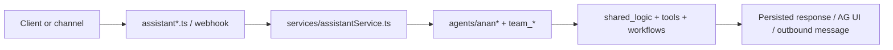

# `ai_zone` Zone

## Ownership And Purpose
`convex/ai_zone` owns assistant endpoints, multi-agent orchestration, AG UI turn assembly, channel adapters, and AI runtime services for Anan.

## Why This Zone Exists
Assistant behavior, channel handling, tool orchestration, and streaming/runtime concerns should not leak across workspace, public, or user flows. `ai_zone` keeps the AI runtime centralized while still delegating shared business facts to `shared_logic`.

## Architecture Overview
- `assistant.ts`, `assistantPublic.ts`, `assistantWorkspace.ts`, `assistantPro.ts`: audience-specific Convex entrypoints
- `services/`: assistant orchestration, AG UI assembly, voice transcription/synthesis, public response shaping
- `agents/core/`: runtime abstractions and registries
- `agents/anan*` and `agents/team_*`: orchestrators, teams, tools, and definitions
- `channels/whatsapp/`: webhook handling, preprocessing, outbound messaging
- `workflows/`: workflow-managed background orchestration

## Flowchart

## Stable Entrypoints
- `assistantWorkspace.ts` for workspace assistant flows
- `assistantPublic.ts` and `assistantPro.ts` for public/pro audience variants
- `assistant.ts` for shared assistant entry wiring
- `channels/whatsapp/webhook.ts` for WhatsApp ingress
- `services/agUi.ts` for AG UI turn shaping inside the AI runtime

## Outside-In Usage
Call `ai_zone` through assistant entry files or channel/webhook entrypoints. Do not import individual team agents or internal tool modules from outside the zone. If a feature needs shared business data, route that need through `shared_logic` or documented service helpers rather than coupling directly to team internals.

## Allowed And Forbidden Imports
- Allowed: `_core`, `shared_logic`, workflow/channel infrastructure
- Allowed: internal reuse across `services/`, `agents/`, `channels/`
- Forbidden: UI/server route code, or direct external consumption of `team_*` folders
- Forbidden: bypassing the orchestrator and calling team internals as if they were public APIs

## Dependency Map
- Upstream consumers: workspace chat, public assistant surfaces, user-facing channels, internal AI workflows
- Downstream dependencies: `shared_logic`, storage, LLM providers, workflow runtime, channel transport

## Common Extension Tasks
- Add a new assistant flow: start with the appropriate `assistant*.ts` entrypoint and its service wiring
- Add a new agent or tool: place it under the correct `agents/team_*` folder and register it through the orchestrator
- Add a new channel adapter: place preprocessing/webhook logic under `channels/`

## Related Docs
- `convex/ai_zone/ZONE_REGISTER.md`
- `convex/ai_zone/ZONE_AUDIT.md`
- `docs/handbook/convex/ai-zone.md`
