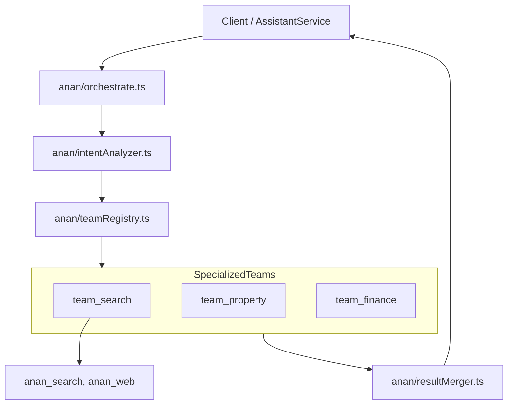

# Backend AI Multi-Agent System (Orchestration Zone)

## 1. Role in the Fortress
The `ai_zone` acts as the cross-cutting intelligence layer. It is organized into specialized **Teams**, minimizing the "God Object" anti-pattern in AI logic.

## 2. Architecture Diagram (Multi-Agent)



## 3. Deployment Rules

1. **Orchestrator Primacy:** The `anan` module is the ONLY entrance to agent logic. Never import an agent configuration directly inside a Convex mutation.
2. **Team Encapsulation:** Tools for a team (web scraping, bank API calls) MUST live inside the `team_X/tools/` directory. They are private to that team unless explicitly moved to `shared/` for cross-team use.
3. **Agent Configuration:** Every agent is a configuration of the `AnanAgent` base class. 
   - **X** DO NOT write custom agent loop logic.
   - **X** DO NOT hardcode LLM prompts in strings; use `config.ts`.
4. **Resiliency:** 
   - Use `shared/errorHandler.ts` for any external API call (OpenRouter, Serper, Google).
   - Use `shared/tokenTracker.ts` for every agent completion to ensure financial observability.

## 4. Documentation Standard
Every file in the `anan` orchestrator or any team agent MUST use the `WHY/WHAT/HOW` JSDoc standard.

```typescript
/**
 * WHY:   Reduces specific user queries into actionable intents for team routing.
 * WHAT:  Parses the prompt and returns a list of required team IDs.
 * HOW:   Uses a low-temperature, fast LLM call with a strict JSON schema.
 */
export async function analyzeIntent(...) { ... }
```
