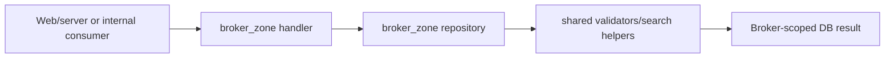

# Backend: `broker_zone`

## Ownership And Purpose
`convex/broker_zone` owns broker-scoped backend entrypoints for overview and property flows, plus the repositories that enforce broker ownership at the persistence boundary.

## Why This Zone Exists
Brokers need a constrained view of shared business data. This zone exposes broker-only backend handlers without duplicating the deeper reusable rules that belong in `shared_logic`.

## Architecture Overview
- `overview.ts`: broker overview counters/projections
- `properties.ts`: broker-facing property CRUD/publish handlers
- `repositories/`: broker ownership-aware reads/writes shared by the handlers

## Flowchart

## Stable Entrypoints
- `overview.ts`
- `properties.ts`
- `repositories/overviewRepository.ts`
- `repositories/propertiesRepository.ts`

## Outside-In Usage
Use `broker_zone` when the caller needs broker-owned overview or property behavior. If the behavior must also serve developers, admin, mobile, or AI consistently, it belongs in `shared_logic` instead. Do not import `red_zone` from here.

## Allowed And Forbidden Imports
- Allowed: `_core`, `shared_logic`, local repositories
- Allowed: web/server broker adapters and generated API refs
- Forbidden: `admin_zone` internals and duplicate shared business logic
- Forbidden: deep imports from `red_zone`

## Dependency Map
- Upstream consumers: web broker server services, internal tooling/tests
- Downstream dependencies: local repositories, shared validators/search helpers, schema

## Common Extension Tasks
- Add a broker property mutation: start in `properties.ts`, then move persistence details into `repositories/propertiesRepository.ts`
- Add a new broker-only overview projection: place it in `overview.ts` or a new repository/helper if it grows

## Related Docs
- `convex/broker_zone/ZONE_REGISTER.md`
- `convex/broker_zone/ZONE_AUDIT.md`
