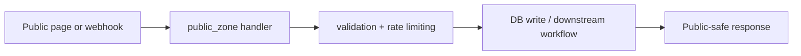

# `public_zone` Zone

## Ownership And Purpose
`convex/public_zone` owns unauthenticated or public-entry backend flows such as inbound contact capture and public form submission.

## Why This Zone Exists
Public entrypoints need different risk controls, payload validation, and rate-limiting considerations than authenticated workspace or admin flows. This zone keeps those public-facing contracts isolated.

## Architecture Overview
- `contact.ts`: public contact inquiry capture
- `forms.ts`: public form submission handling

## Flowchart

## Stable Entrypoints
- `contact.ts`
- `forms.ts`

## Outside-In Usage
Use `public_zone` when the caller is intentionally unauthenticated or public. If the flow requires workspace/session ownership, move it to the appropriate server or backend owner zone instead.

## Allowed And Forbidden Imports
- Allowed: `_core`, `shared_logic`, rate limiting/middleware helpers
- Allowed: public pages and public API controllers
- Forbidden: authenticated workspace logic or admin-only operations
- Forbidden: leaking public payload handling into authenticated zones

## Dependency Map
- Upstream consumers: public site entrypoints, public API handlers
- Downstream dependencies: validation, rate limiting, shared helpers, schema

## Common Extension Tasks
- Add a new public intake: create a focused handler file and keep rate limiting/validation explicit
- Reuse logic in authenticated flows only by promoting the reusable part to `shared_logic`

## Related Docs
- `convex/public_zone/ZONE_REGISTER.md`
- `convex/public_zone/ZONE_AUDIT.md`
