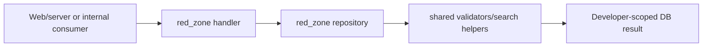

# Backend: `red_zone`

## Ownership And Purpose
`convex/red_zone` owns developer-scoped backend entrypoints for overview and property flows, plus the repositories that enforce developer ownership at the persistence boundary.

## Why This Zone Exists
Developers need a constrained backend view that respects RED ownership while still reusing shared business rules from `shared_logic`. This zone is the developer-side counterpart to `broker_zone`.

## Architecture Overview
- `overview.ts`: developer overview counters/projections
- `properties.ts`: developer-facing property CRUD/publish handlers
- `repositories/`: developer ownership-aware reads/writes shared by the handlers

## Flowchart

## Stable Entrypoints
- `overview.ts`
- `properties.ts`
- `repositories/overviewRepository.ts`
- `repositories/propertiesRepository.ts`

## Outside-In Usage
Use `red_zone` when the caller needs developer-owned overview or property behavior. If the logic must be shared with brokers, admin, mobile, or AI, move it to `shared_logic` and keep `red_zone` focused on ownership-specific constraints and contracts.

## Allowed And Forbidden Imports
- Allowed: `_core`, `shared_logic`, local repositories
- Allowed: web/server developer adapters and generated API refs
- Forbidden: duplicated broker logic and direct imports from `admin_zone`
- Forbidden: business logic that should live in `shared_logic`

## Dependency Map
- Upstream consumers: web RED server services, internal tooling/tests
- Downstream dependencies: local repositories, shared validators/search helpers, schema

## Common Extension Tasks
- Add a developer property mutation: start in `properties.ts`, then move persistence details into `repositories/propertiesRepository.ts`
- Add a new developer-only overview projection: place it in `overview.ts` or a new repository/helper if it grows

## Related Docs
- `convex/red_zone/ZONE_REGISTER.md`
- `convex/red_zone/ZONE_AUDIT.md`
