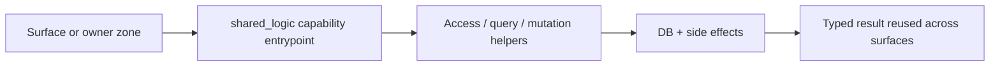

# `shared_logic` Zone

## Ownership And Purpose
`convex/shared_logic` owns reusable business capabilities that must behave consistently across workspace, admin, mobile, channels, and AI. It is the default home for backend business rules that are shared across multiple audiences.

## Why This Zone Exists
Owner zones and frontend runtimes should not duplicate business behavior. `shared_logic` keeps search, offers, agencies, inbox, market, compliance, files, users, notifications, and workflow helpers in one backend-owned layer.

## Architecture Overview
- Capability folders such as `offers/`, `properties/`, `market/`, `agencies/`, `users/`, `subscriptions/`, `verifications/`
- Shared infra helpers in `lib/` for retry, providers, generated refs, language, HTTP, storage, middleware
- Legacy root entry files such as `inbox.ts`, `market.ts`, `offers.ts`, `notifications.ts`, `uploadthing.ts`, `workspaceWorkflows.ts`

## Flowchart

## Stable Entrypoints
- Capability roots such as `offers/index.ts`, `properties/*`, `agencies/repositories/index.ts`, `users/index.ts`, `verifications/index.ts`
- Root business files such as `inbox.ts`, `market.ts`, `offers.ts`, `uploadthing.ts`
- `lib/generatedApiRefs.ts` for typed API/internal refs shared across backend code

## Outside-In Usage
Use `shared_logic` when the behavior should stay identical for more than one surface or zone. Prefer the capability entrypoint or documented root module. Do not reach into another capability's private helper files unless that helper is already an intentional shared primitive.

## Allowed And Forbidden Imports
- Allowed: `_core`, same capability modules, documented shared helpers from `lib/`
- Allowed: owner zones and AI may consume shared capabilities through their public entrypoints
- Forbidden: importing UI/server route code, or duplicating capability logic in owner zones
- Forbidden: deep-importing random files from another capability when an entrypoint already exists

## Dependency Map
- Upstream consumers: `ai_zone`, owner zones, admin, public, mobile, web server gateways
- Downstream dependencies: `_core`, storage/http/provider helpers, external services as wrapped by shared helpers

## Common Extension Tasks
- Add a reusable business capability: create a new subfolder with clear access/query/mutation boundaries
- Share a helper across capabilities: add it to `lib/` only if it is truly generic
- Promote duplicated owner-zone logic here only when the ownership is genuinely cross-audience

## Related Docs
- `convex/shared_logic/ZONE_REGISTER.md`
- `convex/shared_logic/ZONE_AUDIT.md`
- `docs/handbook/convex/shared-logic.md`
