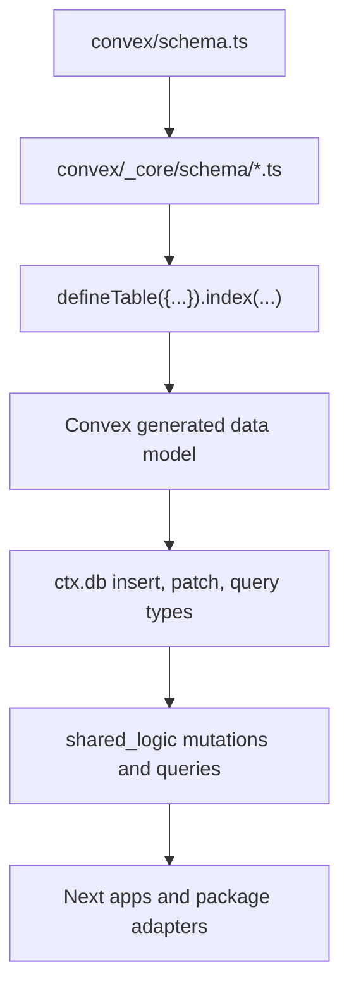

# Convex Schema Deep Dive

This document explains how the Anan Convex schema is assembled, how each schema module works, and how the security hardening layer should be used when adding or changing tables.

## Mental Model

Convex has one exported schema entrypoint:

```ts
// convex/schema.ts
export default defineSchema({
  ...usersTables,
  ...authTables,
  ...agenciesTables,
  ...propertiesTables,
  ...searchTables,
  ...knowledgeTables,
  ...salesTables,
  ...crmTables,
  ...offersTables,
  ...aiTables,
  ...workspaceTables,
  ...adminTables,
  ...contactTables,
  ...formsTables,
  ...organizationTables,
  ...projectsTables,
  ...realEstateOsTables,
  ...auditTables,
  ...integrationTables,
});
```

Each imported module under `convex/_core/schema/*` exports an object of table definitions. `convex/schema.ts` merges those objects and passes the final table map to `defineSchema`.

The schema layer has three jobs:

1. Define persisted table shape.
2. Define indexes for every hot read path.
3. Encode security-sensitive invariants that Convex can enforce structurally.

The schema layer does not replace write-path validation. Convex validators can enforce required fields, unions, object shapes, IDs, arrays, and records. They cannot enforce URL host trust, checksum regexes, MIME magic bytes, or cross-field rules like "PDF means kind is pdf". Those rules must live in mutation/service code and tests.

## Assembly Flow



Important consequence: changing a schema validator changes the generated document type. Any mutation, test, or adapter that writes the table may start failing typecheck. That is good. It means schema hardening is actually being enforced.

## Security Building Blocks

Shared security validators live in `convex/_core/schema/securityValidators.ts`.

Use these validators instead of anonymous `v.string()` or `v.any()` at security boundaries:

| Validator | Purpose | Notes |
| --- | --- | --- |
| `trustedUploadUrlValidator` | Names URL fields that must come from trusted upload storage | Convex sees this as a string. Host validation belongs in write-path code. |
| `verifiedUploadMimeValidator` | Allows only `image/jpeg`, `image/png`, `image/webp`, `application/pdf` | Use for persisted verified uploads. |
| `imageUploadMimeValidator` | Allows only image MIME types | Use when PDFs are not valid for the domain. |
| `sha256HexValidator` | Names checksum fields | Regex validation belongs in write-path code. |
| `positiveFileSizeValidator` | Names size fields that must be positive | Write-path code must reject zero, negative, non-finite values. |
| `tenantOrgIdValidator` | Names tenant IDs from Better Auth or external tenant context | Prefer tenant-first indexes for tenant reads. |
| `redirectUriValidator` | Names normalized OAuth redirect URIs | Backend validation must reject remote HTTP, fragments, userinfo, and unregistered URIs. |
| `tokenHashValidator` | Names persisted token hashes | Raw tokens must not be stored in app OAuth tables. |
| `oauthScopeValidator` | Names OAuth scopes | Scope allowlisting is enforced by the OAuth registry, not duplicated in schema. |
| `boundedMetadataValidator` | Allows shallow JSON-like metadata | Use for audit logs, inbox metadata, webhook snapshots, and other security-sensitive metadata. |
| `unsafeDynamicPayloadValidator` | Explicit escape hatch for dynamic payloads | Use only for AI, rules engines, legacy dynamic documents, or before/after audit snapshots. |

Rule: new security-sensitive schemas should not use raw `v.any()`. If truly dynamic data is unavoidable, use `unsafeDynamicPayloadValidator` so future reviewers can find and audit intentional dynamic payloads.

## Security Field Groups

Shared attribution and lifecycle fields live in `convex/_core/schema/securityFields.ts`.

| Field group | Use case | Shape |
| --- | --- | --- |
| `globalSecurityFields` | New non-tenant tables with full attribution | Requires `createdBy`, `updatedBy`, `createdAt`, `updatedAt`; optional `deletedAt`, `encryptedFields`. |
| `tenantSecurityFields` | New tenant tables with full attribution | Adds required `orgId`. |
| `transitionalGlobalSecurityFields` | Existing hybrid tables during migration | Optional attribution and lifecycle fields. |
| `transitionalTenantSecurityFields` | Existing tenant tables during migration | Optional `orgId` plus optional attribution. |

Current schema uses the transitional fields heavily because historical rows and mixed write paths still exist. Do not copy that pattern for new tables unless the table is explicitly migration-only. New tenant-owned tables should require a tenant identity.

## File And Upload Model

Reusable embedded upload references live in `convex/_core/schema/uploadedFiles.ts`.

There are two shapes:

```ts
legacyUploadedFileReferenceValidator
verifiedUploadedFileReferenceValidator
uploadedFileReferenceValidator = union(verified, legacy)
```

The union exists for backward compatibility with existing rows that may not have size, MIME, checksum, or visibility. New writes should produce the verified shape:

```ts
{
  key: string;
  url: trustedUploadUrlValidator;
  name: string;
  size: positiveFileSizeValidator;
  mime: verifiedUploadMimeValidator;
  sha256: sha256HexValidator;
  visibilityScope: "organization" | "project_private_share" | "public_project";
}
```

The canonical tracked-upload table is `organizationAssets` in `convex/_core/schema/properties.ts`.

Important fields:

| Field | Meaning |
| --- | --- |
| `tenantOrgId` | Tenant owner for asset isolation. |
| `uploaderAuthUserId` | Auth user that uploaded or registered the asset. |
| `category` | Business category: project image, project document, chat attachment, offer attachment, verification document. |
| `kind` | Render/storage classification: image or pdf. |
| `key` | Upload storage key. |
| `url` | Trusted upload URL. |
| `mime` | Verified allowlisted MIME. |
| `sha256` | Content checksum. Kept optional in schema for legacy compatibility, but new write paths require it. |
| `visibilityScope` | Distribution policy for the asset. |
| `lifecycleState` | Active, archived, pending delete, or deleted. |
| `attachedEntityType` and `attachedEntityId` | Optional link to project, conversation, or offer. |

Security rules for upload writes:

1. Only trusted UploadThing hosts are accepted.
2. Only allowlisted MIME types are accepted.
3. New active assets require `sha256`.
4. Property media cannot be PDF.
5. Private documents should not be redistributed as raw public URLs.
6. Attachment mutations should link existing tenant-owned assets by key rather than blindly trusting client-provided file metadata.

## OAuth And Auth Model

Canonical first-party OAuth tables live in `convex/_core/schema/auth.ts`.

Do not use `convex/betterAuth/schema.ts` as the canonical Anan OAuth storage model. That file is generated by Better Auth and contains raw fields such as generated `oauthAccessToken.accessToken`, `oauthAccessToken.refreshToken`, and `oauthApplication.clientSecret`. It must stay generated-only and must not be imported into `convex/schema.ts`.

Canonical OAuth tables:

| Table | Purpose |
| --- | --- |
| `oauthClients` | Minimal external OAuth client mirror: client id, display metadata, redirect URIs, scopes, trusted/active flags, and timestamps. |
| `oauthAuthorizations` | User or tenant grant for a client and scope set. |
| `oauthAuthCodes` | Short-lived authorization codes with PKCE S256 challenge. |
| `oauthAccessTokens` | App access token records using `jti`, not raw token bodies. |
| `oauthRefreshTokens` | Hashed refresh tokens, token family, replay detection, rotation metadata. |
| `oauthFlowState` | Authorization request state, redirect URI, PKCE challenge, expiry, and use marker. |
| `oauthSubjectMappings` | Pairwise subject IDs for OAuth user identity. |
| `oauthAuditLogs` | Bounded audit metadata for OAuth events. |

OAuth schema hardening points:

1. Redirect URI fields use `redirectUriValidator`.
2. Scope arrays use `oauthScopeValidator`, with allowlisting in OAuth registry write paths.
3. App review and lifecycle state belongs outside Anan; OAuth validation only checks mirror availability plus trusted/active flags.
4. Refresh token persistence uses `tokenHashValidator`, not raw refresh tokens.
5. `oauthAuditLogs.metadata` uses `boundedMetadataValidator`.
6. Flow state has `state_expiresAt` index for state lookup and cleanup.
7. Refresh token family indexes support replay/revocation checks.
8. Authorizations have a tenant/client/revocation index for tenant-scoped grant checks.

Required OAuth write-path invariants:

1. Redirect URIs must be HTTPS except localhost loopback.
2. Redirect URIs must reject fragments, username, and password.
3. PKCE must be `S256`.
4. `state` must round-trip and be single-use.
5. Testing apps must not request privileged scopes.
6. Testing apps must not grant access against real tenant data unless an explicit sandbox tenant is used.
7. Refresh token replay must revoke the token family and active access tokens.

## Webhook And Integration Model

Integration tables live in `convex/_core/schema/integrations.ts`.

`zaneAiWebhookOutbox` is the durable outbox for Anan-to-ZaneAI sync. It stores pending, delivering, delivered, failed, or dead events.

The payload is no longer raw `v.any()`. It is a typed object:

```ts
{
  version: string;
  action:
    | "organization.upsert"
    | "organization.archive"
    | "project.upsert"
    | "project.archive"
    | "unit.upsert"
    | "unit.archive";
  occurredAt: number;
  source: {
    system: "anan";
    environment: string;
    tenantOrgId?: string;
  };
  actor?: boundedMetadata;
  organization?: boundedMetadata;
  project?: boundedMetadata;
  unit?: boundedMetadata;
}
```

This is intentionally stricter than the previous model. Unknown webhook actions should fail at insert time instead of silently entering the outbox.

## Audit Model

Audit tables live in `convex/_core/schema/audit.ts`.

| Table | Purpose |
| --- | --- |
| `auditLog` | Append-only operational/security audit trail. |
| `encryptionKeys` | Envelope-encryption metadata. |

`auditLog.metadata` is bounded because it is security-sensitive and often user-influenced. `before` and `after` use `unsafeDynamicPayloadValidator` because historical snapshots may have arbitrary shape. That distinction is intentional:

- `metadata` should be small and predictable.
- `before` and `after` are snapshots and must be handled carefully by readers.

## Workspace And Inbox Model

Workspace tables live in `convex/_core/schema/workspace.ts`.

| Table | Purpose |
| --- | --- |
| `inboxConversations` | Direct or workspace conversation shell. |
| `inboxConversationParticipants` | Participant membership, unread counts, archived state. |
| `inboxMessages` | Text, offer, file, project, deal, invite, and role event messages. |
| `workspaceNotifications` | User notifications for inbox, offers, approvals, and invites. |
| `workspaceNotificationPreferences` | User browser push preference. |
| `workspacePushSubscriptions` | Browser push subscription storage. |

Security-relevant details:

1. `inboxMessages.metadata` uses `boundedMetadataValidator`.
2. `workspaceNotifications.metadata` uses `boundedMetadataValidator`.
3. Message and notification metadata must be sanitized before insertion.
4. Tenant-aware reads should prefer `orgId` indexes where available.
5. File-share messages should reference vetted assets, not arbitrary URLs.

## Domain Schema Modules

### `users.ts`

Tables:

- `userProfiles`
- `users`

This module bridges app profile identity and legacy user identity. `userProfiles` is the more important authorization object because it carries role, org, tenant, broker/developer links, and admin metadata.

Important indexes:

- `authUserId`
- `email`
- `by_orgId`
- `by_orgId_and_role`
- `by_orgId_and_authUserId`

### `agencies.ts`

Tables:

- `brokers`
- `RED`
- `subscriptions`
- `tenantOrgLinks`
- `organizationApiKeys`
- `organizationIntegrationPolicies`
- `organizationApiKeyUsageDaily`
- `teamInvites`
- `organizationMemberships`

This module handles broker/developer organizations, API keys, integration policy, tenant links, legacy team invites, and organization membership.

Security-critical tables:

- `organizationApiKeys` stores `secretHash`, never raw API keys.
- `tenantOrgLinks` maps legacy owner IDs to tenant org IDs.
- `organizationIntegrationPolicies` controls which integration methods are enabled.

### `properties.ts`

Tables:

- `properties`
- `propertyViewerAccess`
- `projectAnalyticsEvents`
- `propertyEngagementDaily`
- `propertyBrokerAnalytics`
- `organizationProjectSummaries`
- `organizationAssets`

This is the listing and asset-heavy module. It contains public listing data, explicit viewer access, analytics rollups, project summaries, and the canonical tracked asset table.

Security-critical tables:

- `propertyViewerAccess` gates explicit shared access.
- `organizationAssets` gates file visibility and lifecycle.
- `projectAnalyticsEvents.metadata` is bounded to avoid untrusted analytics payload sprawl.

### `projects.ts`

Tables:

- `projectDossiers`
- `projectUnits`
- `projectPaymentPlans`
- `projectComplianceDocuments`
- `projectAdLicenses`
- `projectBrokerAuthorizations`
- `projectReadinessEvents`

This module models project readiness, units, payment plans, compliance, licenses, broker authorization, and readiness history.

File fields use the shared uploaded-file reference validators. New project write paths should send verified references where possible.

### `offers.ts`

Tables:

- `offers`
- `offerPackages`
- `offerCases`
- `offerCaseParticipants`
- `offerActivities`

This module models offer packages, offer cases, participants, and case activity. It uses uploaded file reference lists for attachments. Attachments should correspond to tracked `organizationAssets` rows when files are redistributed through workspace flows.

### `crm.ts`

Tables:

- `crmClients`
- `deals`

This module stores tenant CRM contacts/clients and deals. Deal documents use uploaded file reference lists.

### `organizations.ts`

Tables:

- `organizationProfiles`
- `organizationFiles`
- `organizationEntityFiles`
- `organizationAssistantSessions`
- `organizationAssistantEvents`
- `organizationMemories`

This module bridges Better Auth organizations to app-owned organization metadata, files, assistant sessions, assistant events, and memories.

Dynamic organization assistant payloads use `unsafeDynamicPayloadValidator`. Those payloads should never be treated as trusted HTML, trusted URLs, or executable instructions.

### `realEstateOs.ts`

Tables:

- `authUsers`
- `organizations`
- `orgMemberships`
- `orgInvites`
- `orgSubscriptions`
- `oauthGrants`
- `accessTokens`
- `paymentPlans`
- `listingMedia`
- `brokerAuthorizations`
- `adLicenses`
- `crmContacts`
- `caseParticipants`
- `caseActivities`

This is the infrastructure data model for identity, orgs, grants, inventory, CRM, and activity. It overlaps with newer modules and should be treated carefully during migrations. Do not add new duplicate OAuth behavior here unless intentionally migrating.

### `knowledge.ts`

Tables:

- `knowledgePages`
- `developerHandbookPages`
- `agentMemory`
- `entityRelations`
- `assistantThreads`
- `assistantMessages`
- `assistantThreadState`
- `assistantMessageState`
- `assistantStreamEvents`

This module powers agent memory, knowledge graph, assistant threads, and streaming events. Several fields use `unsafeDynamicPayloadValidator` because agent state and stream details are intentionally dynamic.

### `ai.ts`

Tables:

- `aiTokenUsage`
- `aiOrchestrationUsage`
- `aiRAGEntries`
- `userKnowledgeBase`

This module tracks LLM cost/usage, orchestration cost, RAG entries, and user knowledge. Dynamic memory values use `unsafeDynamicPayloadValidator`.

### `search.ts`

Tables:

- `globalSearchCache`
- `knowledgeResearch`
- `searchLogs`

This module stores search cache and research/log records. Tenant/org fields are optional in transitional rows, so reads must still enforce access in query code.

### `sales.ts`

Tables:

- `orders`
- `banks`

This module stores order pipeline records and bank rule data. Bank rules use `unsafeDynamicPayloadValidator` because they are a dynamic rules-engine payload.

### `admin.ts`

Tables:

- `complianceRulesets`
- `verificationRequests`
- `adminDataHealthSummaries`
- `adminSignupInvites`

This module supports admin compliance, verification review, data health, and admin signup invites. Verification submissions and data health details are dynamic and use the explicit unsafe payload validator.

### `audit.ts`

Tables:

- `auditLog`
- `encryptionKeys`

This is the central audit and encryption metadata module. Audit metadata is bounded; snapshots are dynamic.

### `integrations.ts`

Tables:

- `zaneAiWebhookOutbox`

This is the integration outbox module. Its payload is action-constrained and bounded.

### `workspace.ts`

Tables:

- `inboxConversations`
- `inboxConversationParticipants`
- `inboxMessages`
- `workspaceNotifications`
- `workspaceNotificationPreferences`
- `workspacePushSubscriptions`

This is the user collaboration and notification module.

### `contact.ts`

Tables:

- `contactInquiries`

This module stores public/contact form inquiries.

### `forms.ts`

Tables:

- `formSubmissions`

This module stores generic form submissions. It is intentionally flexible, but any new security-sensitive form should get its own strict schema instead of using generic form payloads.

### `gccCompliance.ts`

This module exports GCC compliance validators/constants, not tables. Project compliance schemas import these validators.

## Index Design Rules

Indexes are part of the security and performance model.

Use these rules:

1. Tenant-facing reads should start with `orgId` or `tenantOrgId`.
2. Soft-delete aware lists should include `deletedAt`.
3. Time-ordered dashboards should include `createdAt`, `updatedAt`, `submittedAt`, or `lastActivityAt`.
4. Token/state lookup indexes should support both point lookup and cleanup by expiry.
5. Cross-tenant global indexes are only acceptable for admin or token validation paths that have explicit guards.

Examples:

```ts
.index("tenantOrgId_lifecycleState", ["tenantOrgId", "lifecycleState"])
.index("by_org_active_updatedAt", ["orgId", "deletedAt", "updatedAt"])
.index("state_expiresAt", ["state", "expiresAt"])
.index("tenantOrgId_clientId_revokedAt", ["tenantOrgId", "clientId", "revokedAt"])
```

## Write Path Rules

Schema validation is the last line of defense. Mutations and actions must still validate input before persistence.

For uploads:

1. Check trusted host.
2. Check MIME allowlist.
3. Check magic bytes before trusting MIME.
4. Require checksum.
5. Store visibility policy.
6. Never redistribute private files as raw public URLs.

For OAuth:

1. Normalize and validate redirect URIs before storing.
2. Enforce scope registry.
3. Validate external client mirror trusted/active flags.
4. Store token hashes, not raw token bodies.
5. Use PKCE S256 only.
6. Mark flow state and refresh tokens as used.
7. Revoke refresh families on replay.

For metadata:

1. Prefer typed objects.
2. Use `boundedMetadataValidator` for audit/inbox/webhook style metadata.
3. Use `unsafeDynamicPayloadValidator` only when a domain truly needs arbitrary shape.
4. Never render dynamic payloads as trusted HTML.

## Generated Better Auth Schema

`convex/betterAuth/schema.ts` is generated and must not be hand-edited for app security policy.

It may contain raw fields required by Better Auth internals. The app's canonical OAuth security model is `convex/_core/schema/auth.ts`, not the generated Better Auth OAuth tables.

The guard test in `convex/_core/schema/securitySchema.test.ts` checks that the main Convex schema does not import the Better Auth generated schema.

## How To Add A New Table Safely

Follow this checklist:

1. Pick the owning schema module under `convex/_core/schema`.
2. If the table is tenant-owned, require `orgId` or `tenantOrgId` unless this is a documented transition table.
3. Include attribution/lifecycle fields using the strongest field group possible.
4. Avoid `v.any()`. Use a typed object, `boundedMetadataValidator`, or the named unsafe escape hatch.
5. Add tenant-first indexes for tenant reads.
6. Add expiry/status indexes for cleanup workers.
7. Add write-path validation in the mutation/service layer.
8. Add negative tests for malformed input and tenant bypass.
9. Run typecheck so generated data model issues surface immediately.

## Verification Commands

Use these after schema changes:

```bash
pnpm typecheck
pnpm exec vitest run convex/_core/schema/securitySchema.test.ts
pnpm exec vitest run convex/shared_logic/integrations/uploadthing.test.ts
pnpm exec vitest run convex/shared_logic/oauth/internal/tokens.test.ts
pnpm --filter @anan/auth build
pnpm --filter @anan/auth-sdk build
pnpm --filter @anan/authorization build
```

If a schema change touches a domain module, also run that domain's tests. Examples:

```bash
pnpm exec vitest run convex/shared_logic/offers/cases/mutations.test.ts
pnpm exec vitest run convex/shared_logic/projects/access.test.ts
```
