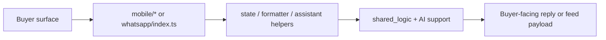

# `user_zone` Zone

## Ownership And Purpose
`convex/user_zone` owns buyer-facing backend flows, currently split into mobile feed/assistant endpoints and WhatsApp conversation state/reply handling.

## Why This Zone Exists
Buyer/user flows have different contracts, cadence, and channel needs than workspace or admin flows. This zone keeps those user-facing contracts focused while still reusing `shared_logic` and AI infrastructure where appropriate.

## Architecture Overview
- `mobile/`: buyer feed, property context, mobile assistant response contracts
- `whatsapp/`: channel contracts, formatting, search/property reply flow, handoff, and message state

## Flowchart

## Stable Entrypoints
- `mobile/feed.ts`
- `mobile/assistant.ts`
- `mobile/contracts.ts`
- `whatsapp/index.ts`
- `whatsapp/contracts.ts`

## Outside-In Usage
Use `user_zone` when you are building a buyer-facing mobile or WhatsApp flow. Consumers should call the documented mobile or WhatsApp entrypoints, not import internal formatters/state helpers directly unless they are already part of the same subzone implementation.

## Allowed And Forbidden Imports
- Allowed: `_core`, `shared_logic`, `ai_zone` support where the user flow requires it
- Allowed: internal reuse between `mobile/` and `whatsapp/` only through documented contracts/helpers
- Forbidden: workspace/server UI code and owner-zone business handlers
- Forbidden: duplicating shared search or compliance logic locally

## Dependency Map
- Upstream consumers: mobile app, WhatsApp ingress, user-facing assistant flows
- Downstream dependencies: `shared_logic`, AI support helpers, message state, schema

## Common Extension Tasks
- Add a new mobile payload field: start in `mobile/contracts.ts` and then update the feed/assistant builders
- Add a WhatsApp reply behavior: wire it through `whatsapp/index.ts` and the focused flow/state helpers

## Related Docs
- `convex/user_zone/ZONE_REGISTER.md`
- `convex/user_zone/ZONE_AUDIT.md`
