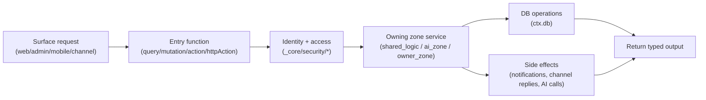

# Convex Handbook (Primary Backend)

---

## WHY

Convex is the “spine” of Anan. Every surface depends on Convex for:

- identity + access policy,
- shared business logic (offers, inbox, properties, market),
- AI orchestration,
- channel ingress and webhook processing,
- persistence and real-time updates.

If Convex is inconsistent, every surface becomes inconsistent.

---

## WHAT

This chapter gives the Convex mental model and maps the folder structure into responsibilities:

- `_core` for schema and security,
- `shared_logic` for shared capabilities,
- `ai_zone` for assistant + channels,
- audience zones for owner-scoped endpoints (`broker_zone`, `red_zone`, `user_zone`, `admin_zone`, `public_zone`),
- `http.ts` for HTTP ingress and OAuth routing.

Key Convex components in use:

- `convex-tenants` + `convex-authz` for organization membership and invitations.
- `convex-audit-log` for security and compliance events.
- `@mzedstudio/uploadthingtrack` for file tracking metadata.
- `@mzedstudio/llm-cache` for LLM response caching.
- `convex-cascading-delete` for safe cascade deletes.
- `convex-batch-processor` and `@convex-dev/workpool` for background processing.

---

## HOW (Mental Model)

### The Convex “circle” (backend perspective)

### Key entrypoints to recognize

- `convex/schema.ts` — assembles the final schema from `_core/schema/*`.
- `convex/http.ts` — HTTP router (health, WhatsApp webhook, OAuth endpoints, auth HTTP routes).
- `convex/auth.ts` and `convex/auth.config.ts` — auth runtime configuration.
- `convex/_core/security/*` — access policy and identity normalization.
- `convex/shared_logic/*` — shared capabilities (many are further split into subfolders).
- `convex/ai_zone/*` — assistant endpoints, orchestrator, agents, channels.

---

## Where to change code

- **New table/index:** `convex/_core/schema/*` + wire into `convex/schema.ts`.
- **New shared capability:** `convex/shared_logic/<capability>/` (see `shared-logic.md`).
- **New workspace assistant behavior:** `convex/ai_zone/services/*` or agent team tools (see `ai-zone.md`).
- **New channel adapter:** `convex/ai_zone/channels/<channel>/` + add route in `convex/http.ts` (see `channels.md`).
- **New admin operational projection:** `convex/admin_zone/*`.
- **New mobile endpoint:** `convex/user_zone/mobile/*`.

---

## Common pitfalls

- Putting business logic into `_core` (forbidden; `_core` is definitions and security only).
- Solving “shared behavior” by copy/pasting code into multiple zones.
- Using `take(N)` to resolve a recipient/target (correctness breaks at scale).
- Querying entire tables and filtering in JS (slow and expensive).
- Writing channel handlers that are not idempotent (webhooks retry).

---

## References

- Rules: `CONVEX_RULES.md`
- Zone boundaries: `convex/*/ZONE_README.md`
- High-level architecture: `ARCHITECTURE.md`
- Best practices: `docs/handbook/convex/best-practices.md`
- Search: `docs/handbook/convex/search.md`
