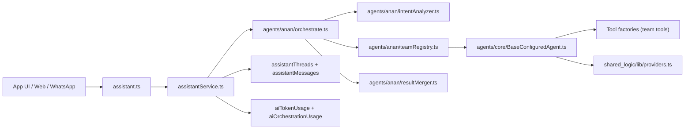
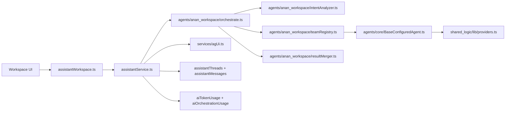
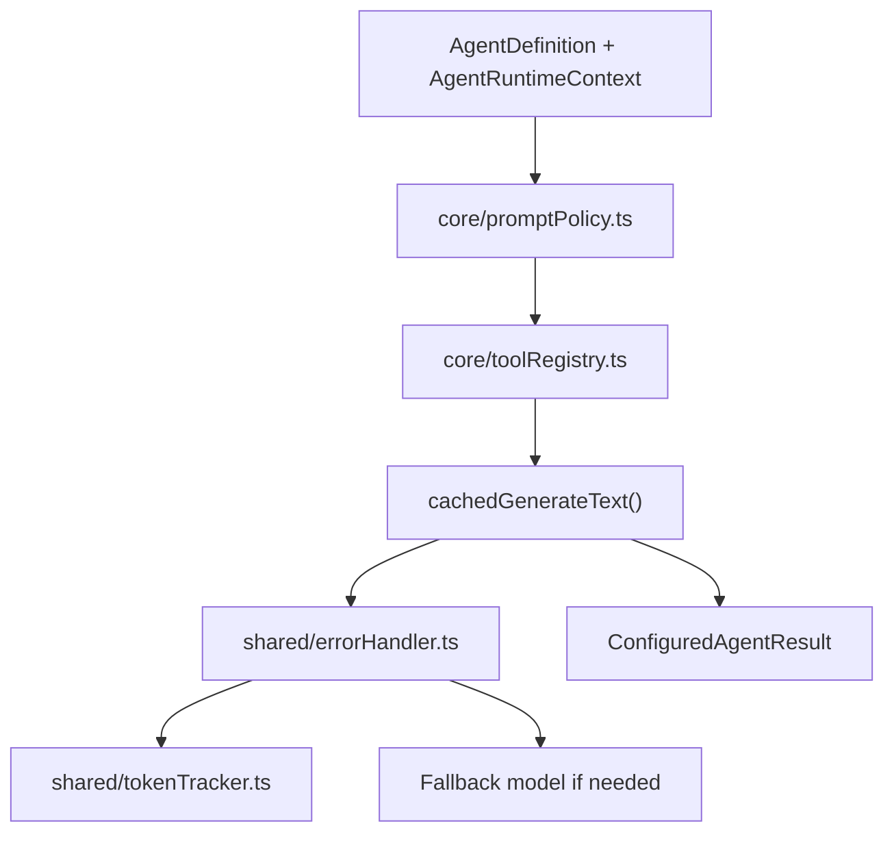
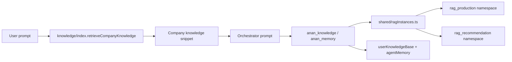
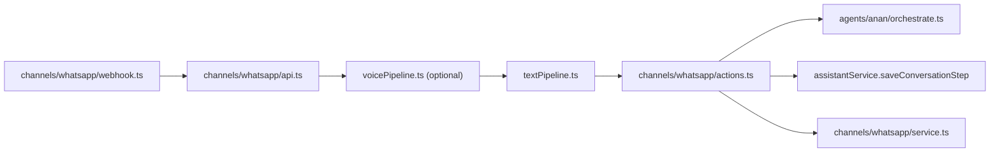

# AI Zone Deep Dive (Developers)

This document is a deep technical map of `convex/ai_zone`, including orchestration flows, runtime behavior, data persistence, channels, and extension points. It is meant to help engineers add agents, tools, teams, and new channels without breaking the platform.

---

## Scope and Ownership

`convex/ai_zone` owns:
- Assistant endpoints for app and workspace flows.
- Orchestrators, team registries, agent runtime, and prompt policies.
- AI channel adapters (WhatsApp today).
- RAG and memory helpers.
- Token and orchestration analytics.

Two orchestrators are fully isolated:
- `anan` for public user flows.
- `anan_workspace` for partner workspace flows.

---

## Directory Map (Core Files)

- `convex/ai_zone/assistant.ts` Public assistant endpoints and thin controllers.
- `convex/ai_zone/assistantWorkspace.ts` Partner workspace endpoints and prompt prefix.
- `convex/ai_zone/assistantPro.ts` Compatibility re-export of workspace endpoints.
- `convex/ai_zone/services/assistantService.ts` Identity resolution, context assembly, orchestration dispatch, persistence.
- `convex/ai_zone/services/agUi.ts` Workspace UI turn synthesis and card payloads.
- `convex/ai_zone/agents/core/*` Shared runtime, registry validation, prompt policy, tool resolution.
- `convex/ai_zone/agents/anan/*` Public orchestrator (intent, dispatch, merge).
- `convex/ai_zone/agents/anan_workspace/*` Workspace orchestrator (intent, dispatch, merge).
- `convex/ai_zone/agents/team_*/*` Agent definitions and tools for each team.
- `convex/ai_zone/agents/shared/*` Retry logic, token tracking, RAG helpers, workflows.
- `convex/ai_zone/channels/*` Channel adapters (WhatsApp webhook, preprocessing, rules).

---

## Flowchart: Public Assistant Request (anan)

---

## Flowchart: Workspace Assistant Request (anan_workspace)

---

## Agent Runtime Pipeline (Single Agent)

Key behaviors:
- Prompt sections are structured (`identity`, `scope`, `toolUsage`, `output`, `safety`).
- Tools are resolved at runtime from factories.
- Retry and fallback are centralized and non-optional.
- Token usage is tracked after every agent call.

---

## Team and Agent Registry (Public Orchestrator)

Source: `convex/ai_zone/agents/anan/orchestrationConfig.ts`

| Team | Agents | Allowed Roles | Notes |
|---|---|---|---|
| `team_search` | `anan_search`, `anan_web` | `user`, `broker`, `admin` | Property search + external web data. |
| `team_property` | `anan_property`, `anan_recommender` | `user`, `broker`, `RED`, `admin` | Matching, comparison, recommendations. |
| `team_finance` | `anan_finance`, `anan_banks` | `user`, `admin` | Financing and bank bundles. |
| `team_knowledge` | `anan_knowledge`, `anan_memory` | `user`, `broker`, `RED`, `admin` | Knowledge and memory. |
| `team_platform` | `anan_platform_docs` | `broker`, `RED`, `admin` | Platform architecture guidance. |
| `team_trainer` | `anan_trainer` | `admin` | Background learning from conversations. |

---

## Team and Agent Registry (Workspace Orchestrator)

Source: `convex/ai_zone/agents/anan_workspace/orchestrationConfig.ts`

| Team | Agents | Allowed Roles | Notes |
|---|---|---|---|
| `team_workspace_projects` | `anan_workspace_projects` | `broker`, `RED`, `admin` | Project ops and summaries. |
| `team_workspace_offers` | `anan_workspace_offers` | `broker`, `RED`, `admin` | Offer/commission ops. |
| `team_workspace_crm` | `anan_workspace_crm` | `broker`, `RED`, `admin` | CRM pipeline and next actions. |
| `team_workspace_org` | `anan_workspace_org` | `broker`, `RED`, `admin` | Org setup and access. |
| `team_workspace_inbox` | `anan_workspace_inbox` | `broker`, `RED`, `admin` | Inbox triage and next steps. |

---

## Tool Catalog (Public Orchestrator)

Source: `convex/ai_zone/agents/anan/orchestrationConfig.ts`

| Tool Key | Purpose | Factory |
|---|---|---|
| `search_smart_property` | Internal property search. | `team_search/anan_search/tools/smartPropertySearch.ts` |
| `search_last_context` | Reuse search context. | `team_search/anan_search/tools/getLastSearchContext.ts` |
| `search_last_findings` | Reuse last search findings. | `team_search/anan_search/tools/getLastSearchFindings.ts` |
| `web_browse_extract` | External web extraction. | `team_search/anan_web/tools/browseAndExtract.ts` |
| `property_last_context` | Property analysis context. | `team_property/tools/getLastSearchContext.ts` |
| `property_last_findings` | Property analysis findings. | `team_property/tools/getLastSearchFindings.ts` |
| `property_memory_context` | Preferences memory. | `team_property/tools/getMemoryContext.ts` |
| `finance_bank_bundles` | Bank product bundles. | `team_finance/tools/getBankBundles.ts` |
| `finance_estimate_mortgage` | Mortgage estimation. | `team_finance/tools/estimateMortgage.ts` |
| `knowledge_get_page` | Knowledge snippets (RAG). | `team_knowledge/tools/getKnowledgePage.ts` |
| `memory_get_context` | User memory context. | `team_knowledge/tools/getMemoryContext.ts` |
| `memory_store_preference` | Store user preference. | `team_knowledge/tools/storeUserPreference.ts` |
| `memory_store_interaction` | Store interaction summary. | `team_knowledge/tools/storeInteraction.ts` |
| `platform_handbook_snippets` | Developer handbook snippets. | `team_platform/tools/getDeveloperHandbookSnippets.ts` |
| `trainer_suggest_entry` | Suggest training entry. | `team_trainer/tools/suggestTrainingEntry.ts` |

Workspace tool catalog is empty by design today and ready for partner ops tools.

---

## Persistence and Data Model

AI zone writes to these tables (see schemas in `convex/_core/schema/*.ts`):

| Table | Purpose | Notes |
|---|---|---|
| `assistantThreads` | Conversation threads per user. | Stores owner type, assistant kind, orchestrator name. |
| `assistantMessages` | User/assistant messages per thread. | Stores `mode` and optional metadata. |
| `aiTokenUsage` | Per-agent token usage and cost. | Written after each agent run. |
| `aiOrchestrationUsage` | Per-request orchestration summary. | Written after orchestration finishes. |
| `aiRAGEntries` | Training data lifecycle. | Recommendation vs production. |
| `userKnowledgeBase` | Per-user memory key/value store. | Updated by memory agents. |
| `agentMemory` | Long-term conversational memory. | Used for preferences and facts. |
| `knowledgePages` | Knowledge base pages. | Used by knowledge agent tools. |
| `developerHandbookPages` | Platform dev docs. | Used by `anan_platform_docs`. |
| `entityRelations` | Knowledge graph links. | Entity-to-entity connections. |

---

## RAG and Memory Flow

Notes:
- Two RAG namespaces are used: production and recommendation.
- `anan_trainer` suggests new RAG entries for review.

---

## WhatsApp Channel Pipeline

Channel rules and limits live in `channels/rules/whatsapp.rules.ts`.

---

## Workspace UI Turn Metadata (AG-UI)

`services/agUi.ts` builds structured UI turns for workspace flows. When the workspace assistant runs, `assistantService.ts` injects `assistantMetadata.uiTurn` for frontend rendering of cards like project drafts, offer drafts, and approval footers.

---

## Workflows

`agents/shared/workflows.ts` defines a durable workflow that replays user messages and re-calls the assistant endpoint. This is used for background or delayed response generation.

---

## Configuration and Validation

Centralized configuration exists per orchestrator:
- `convex/ai_zone/agents/anan/orchestrationConfig.ts`
- `convex/ai_zone/agents/anan_workspace/orchestrationConfig.ts`

Validation and registry helpers live in:
- `convex/ai_zone/agents/core/registry.ts`

Key validations enforced:
- Non-empty prompt sections.
- Unique agent names.
- Team ownership consistency.
- Tool key registration.
- Model allowlist with warning fallback.

---

## Environment Variables (AI Zone)

Required for production behavior:
- `OPENROUTER_API_KEY`
- `OPENROUTER_MODEL`
- `OPENROUTER_WORKSPACE_API_KEY`
- `OPENROUTER_WORKSPACE_MODEL`
- `LLM_MAX_RETRIES`
- `WHATSAPP_ACCESS_TOKEN`
- `WHATSAPP_PHONE_NUMBER_ID`
- `WHATSAPP_VERIFY_TOKEN`

---

## Extension Guide (Add or Change Agents)

Add a public agent:
- Update `convex/ai_zone/agents/anan/orchestrationConfig.ts`.
- Add the agent definition via `defineAgentConfig`.
- Add it to `AGENT_REGISTRY` and a `TeamDefinition` entry.
- Add tools to `TOOL_CATALOG` or reuse existing ones.

Add a workspace agent:
- Update `convex/ai_zone/agents/anan_workspace/orchestrationConfig.ts`.
- Add the agent definition and map it to a `team_workspace_*` team.

Add a new tool:
- Implement a tool factory in the correct team folder.
- Register its key in the orchestrator `TOOL_CATALOG`.
- Reference it via `toolKeys` on the agent definition.

---

## Key Runtime Guarantees

- Orchestrators never call tools directly.
- Agents are the only place tool calls are allowed.
- All LLM calls are retried and token tracked.
- Workspace orchestration is isolated from public orchestration.

---

## Troubleshooting Quick Notes

- If orchestration fails, check `OPENROUTER_API_KEY` or `OPENROUTER_WORKSPACE_API_KEY`.
- If tools return empty, confirm the tool key exists in the catalog.
- If a team is never selected, validate intent analyzer logic and team role access.
