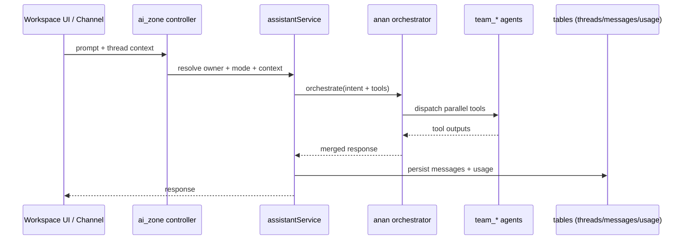

# AI Zone (Orchestrator, Teams, Tools, Persistence)

---

## WHY

The AI zone is a production subsystem, not a toy chatbot:

- it qualifies demand and routes to brokers/developers,
- it produces structured outputs,
- it persists conversation state,
- it powers multi-channel entrypoints (workspace assistant + WhatsApp).

AI logic must be auditable, scoped, and testable.

---

## WHAT

`convex/ai_zone` owns:

- assistant endpoints (`assistant.ts`),
- context assembly (`services/*`),
- multi-agent runtime (`agents/core/*`),
- the `anan` orchestrator (`agents/anan/*`),
- specialized agent teams (`agents/team_*/*`),
- shared AI helpers (`agents/shared/*`),
- channel adapters (`channels/*`).

---

## HOW (Architecture)

### High-level dispatch

### Tool boundary (non-negotiable)

- Orchestrator chooses **which agents** run.
- Agents own **tool calls** (queries/actions) and structured output.
- Orchestrator must not become the place where tool calls happen directly.

### Persistence

The shared assistant surface persists:

- threads (`assistantThreads`),
- messages (`assistantMessages`),
- usage (`aiTokenUsage`, `aiOrchestrationUsage`),
- optional memory/RAG artifacts where implemented.

Rule: persistence must be done in the service layer, not in UI, not in webhook handlers.

---

## Where to change code

- Entry controller: `convex/ai_zone/assistant.ts`
- Context assembly: `convex/ai_zone/services/assistantService.ts`
- Orchestrator: `convex/ai_zone/agents/anan/*`
- Team agents/tools: `convex/ai_zone/agents/team_*/*`
- Channel adapters: `convex/ai_zone/channels/*` (see `channels.md`)

---

## Common pitfalls

- Passing huge “table dumps” as prompt context.
- Blending deterministic mobile assistant logic into orchestrated runtime without a deliberate migration.
- Logging user prompts/PII.
- Creating agent tools that bypass access checks (tools must enforce ownership).

