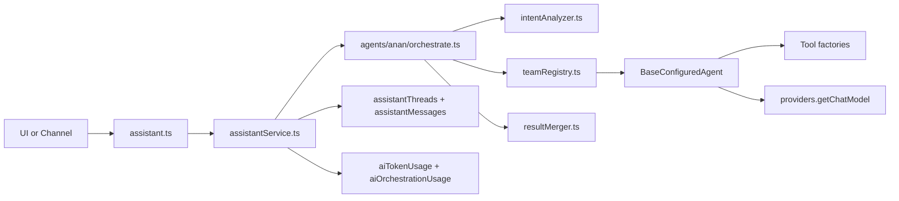
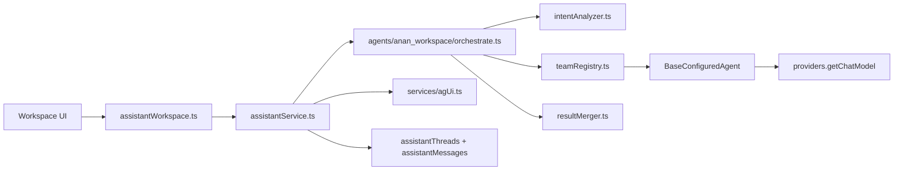
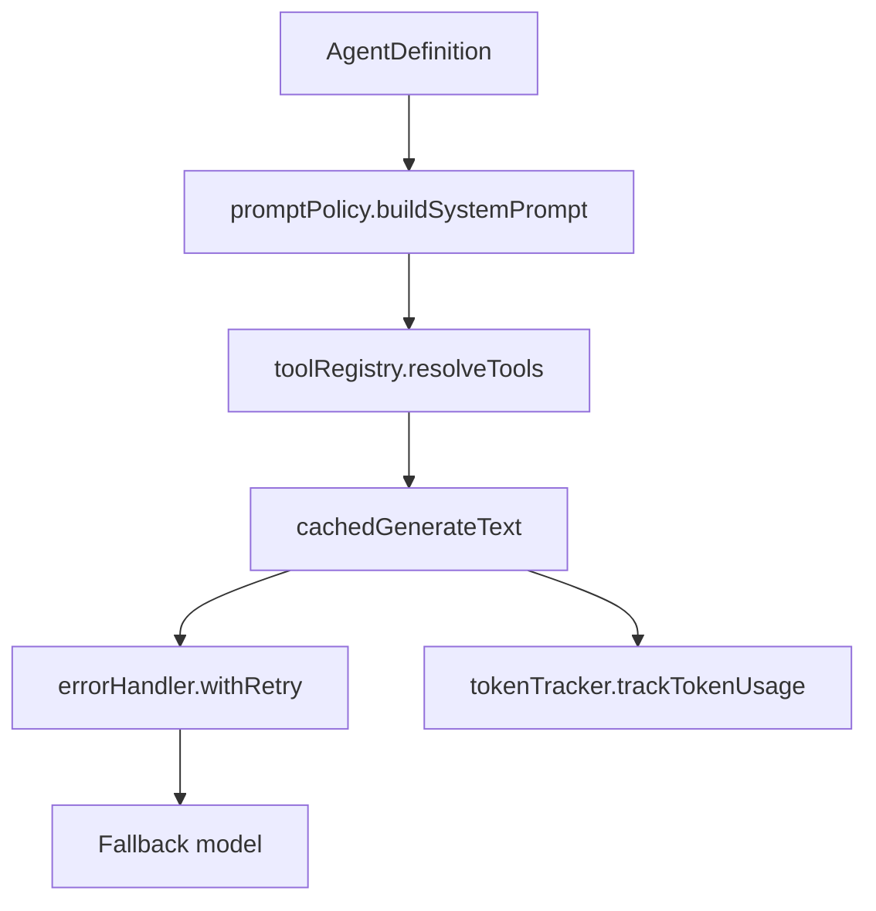

# Runtime and Orchestration Pipeline

## High-Level Flow (Public Assistant)

## High-Level Flow (Workspace Assistant)

## Agent Execution Pipeline

## Key Runtime Guarantees

- Orchestrators only select teams and merge outputs.
- Agents are the only place tool calls happen.
- Retry, fallback, and token tracking are centralized.
- Workspace and public orchestration are isolated by config and runtime.
