# Database Architecture Flowchart

Current state: the original Anan Convex schema is still live. The Real Estate OS database model has been added additively: new non-colliding tables live in `convex/_core/schema/realEstateOs.ts`, and existing production tables were extended with optional OS fields and indexes where names collided.

```mermaid
flowchart TD
  %% ---------------------------------------------------------------------------
  %% Plane 1: Identity and Authorization
  %% ---------------------------------------------------------------------------
  subgraph Identity["Plane 1: Identity and Authorization"]
    LegacyUsers["users\nlegacy/channel buyer identity"]
    AuthUsers["authUsers\nnew credential record"]
    UserProfiles["userProfiles\nworker profile\nlegacy + OS optional fields"]
    MobileBuyers["mobileBuyerAccounts\nlegacy mobile buyer"]
    BuyerAccounts["buyerAccounts\nnew buyer identity"]
    Brokers["brokers\nlegacy broker org"]
    RED["RED\nlegacy developer org"]
    Organizations["organizations\nnew broker/developer org"]
    TenantLinks["tenantOrgLinks\nlegacy tenant bridge"]
    OrgMemberships["orgMemberships\nnew org membership"]
    LegacyMemberships["organizationMemberships\nlegacy membership"]
    TeamInvites["teamInvites\nlegacy invite + OS optional fields"]
    OAuthClients["oauthClients\nlegacy + ownerOrgId/clientName"]
    OAuthGrants["oauthGrants\nnew consent record"]
    AccessTokens["accessTokens\nnew scoped bearer tokens"]
  end

  AuthUsers --> UserProfiles
  AuthUsers --> BuyerAccounts
  LegacyUsers --> MobileBuyers
  UserProfiles --> OrgMemberships
  UserProfiles --> LegacyMemberships
  UserProfiles -->|brokerId| Brokers
  UserProfiles -->|developerId / REDId| RED
  Organizations --> OrgMemberships
  Organizations --> TeamInvites
  Brokers --> TenantLinks
  RED --> TenantLinks
  Organizations --> OAuthClients
  OAuthClients --> OAuthGrants
  AuthUsers --> OAuthGrants
  OAuthGrants --> AccessTokens
  Organizations -->|actingOrgId| AccessTokens

  %% ---------------------------------------------------------------------------
  %% Plane 2: Inventory and Property Data
  %% ---------------------------------------------------------------------------
  subgraph Inventory["Plane 2: Inventory and Property Data"]
    Properties["properties\nlegacy listing + OS publication/location fields"]
    Dossiers["projectDossiers\nlegacy readiness + OS dossier fields"]
    Units["projectUnits\nlegacy units + OS unit fields"]
    ProjectPlans["projectPaymentPlans\nlegacy plans"]
    PaymentPlans["paymentPlans\nnew OS plans"]
    ProjectDocs["projectComplianceDocuments\nlegacy compliance docs"]
    ProjectLicenses["projectAdLicenses\nlegacy ad licenses"]
    AdLicenses["adLicenses\nnew OS ad licenses"]
    ListingMedia["listingMedia\nnew media table"]
    ProjectBrokerAuth["projectBrokerAuthorizations\nlegacy auth contracts"]
    BrokerAuth["brokerAuthorizations\nnew OS broker auth contracts"]
  end

  Organizations -->|orgId optional on legacy table| Properties
  Brokers -->|brokerId| Properties
  RED -->|REDId| Properties
  Properties --> Dossiers
  Dossiers --> Units
  Dossiers --> ProjectPlans
  Dossiers --> PaymentPlans
  Dossiers --> ProjectDocs
  Properties --> ListingMedia
  Properties --> ProjectLicenses
  Properties --> AdLicenses
  Properties --> ProjectBrokerAuth
  Properties --> BrokerAuth
  Organizations --> BrokerAuth

  %% ---------------------------------------------------------------------------
  %% Plane 3: CRM, Workflow, and Communication
  %% ---------------------------------------------------------------------------
  subgraph Workflow["Plane 3: CRM, Workflow, and Communication"]
    CrmClients["crmClients\nlegacy CRM contacts"]
    CrmContacts["crmContacts\nnew OS contacts"]
    Deals["deals\nlegacy pipeline + OS optional fields"]
    Orders["orders\nlegacy sales orders"]
    SalesOrders["salesOrders\nnew formal lead/reservation request"]
    Offers["offers\nlegacy offers"]
    OfferPackages["offerPackages\nlegacy packages + OS optional fields"]
    OfferCases["offerCases\nlegacy cases + OS optional fields"]
    LegacyParticipants["offerCaseParticipants\nlegacy case participants"]
    CaseParticipants["caseParticipants\nnew OS participants"]
    OfferActivities["offerActivities\nlegacy audit trail"]
    CaseActivities["caseActivities\nnew OS audit trail"]
    InboxConversations["inboxConversations\nlegacy direct inbox + OS optional fields"]
    InboxParticipants["inboxConversationParticipants\nlegacy participants"]
    InboxMessages["inboxMessages\nlegacy messages + OS optional fields"]
    Notifications["workspaceNotifications\nlegacy notifications + OS optional fields"]
  end

  Organizations --> CrmContacts
  CrmContacts --> Deals
  CrmClients --> Deals
  UserProfiles -->|assignedTo / assignedToProfileId| Deals
  Properties --> Deals
  BuyerAccounts --> SalesOrders
  Properties --> SalesOrders
  Deals --> SalesOrders
  Properties --> Offers
  Properties --> OfferPackages
  OfferPackages --> OfferCases
  Deals --> OfferCases
  OfferCases --> LegacyParticipants
  OfferCases --> CaseParticipants
  OfferCases --> OfferActivities
  OfferCases --> CaseActivities
  BuyerAccounts --> InboxConversations
  Organizations --> InboxConversations
  InboxConversations --> InboxParticipants
  InboxConversations --> InboxMessages
  UserProfiles --> Notifications

  %% ---------------------------------------------------------------------------
  %% Plane 4: AI and Analytics
  %% ---------------------------------------------------------------------------
  subgraph AI["Plane 4: AI and Analytics"]
    AssistantThreads["assistantThreads\nlegacy + OS buyer/status fields"]
    AssistantMessages["assistantMessages\nlegacy + OS body/sentAt fields"]
    AgentMemory["agentMemory\nlegacy + OS buyer memory fields"]
    UserKnowledge["userKnowledgeBase\nlegacy AI memory"]
    AnalysisRuns["aiConversationAnalysisRuns\nlegacy + OS windowDate/status fields"]
    Analyses["aiConversationAnalyses\nlegacy + OS buyer/run/demand fields"]
  end

  BuyerAccounts --> AssistantThreads
  AssistantThreads --> AssistantMessages
  BuyerAccounts --> AgentMemory
  LegacyUsers --> UserKnowledge
  AssistantThreads --> Analyses
  AnalysisRuns --> Analyses
```

## Current Read

- The database is in a transitional additive state, not a clean greenfield schema.
- Legacy tables are still the production source for most existing app flows.
- New OS tables are ready to be populated by migration/backfill and new write paths.
- Colliding tables are intentionally hybrid until old code is migrated.
