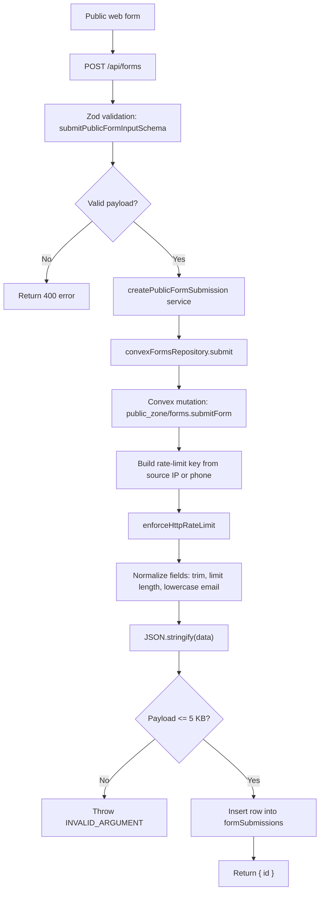
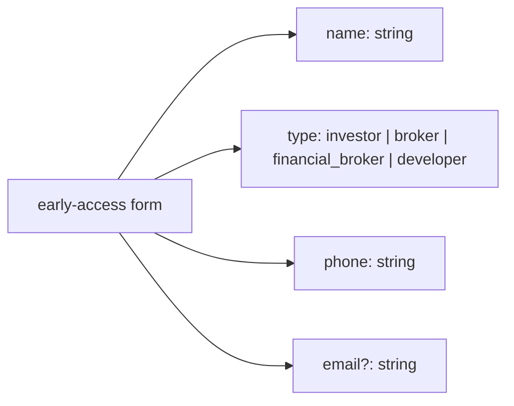
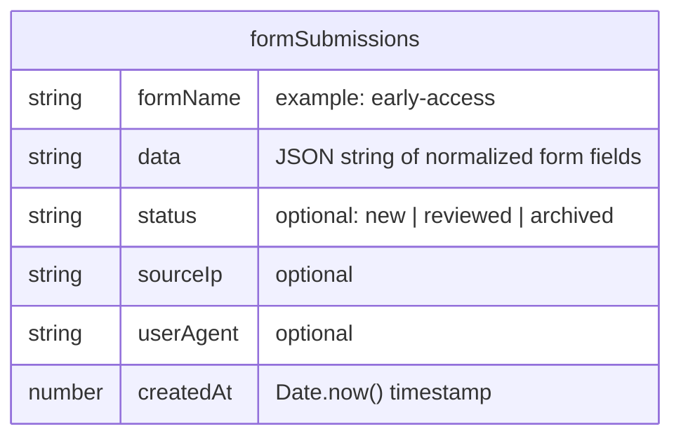

# Public Forms Flowchart

This shows how public form submissions move from the web app into Convex, and how the form data is stored in the database.

## Submission Flow



## Current Form Contract



## Database Schema



## Stored Row Shape

```ts
{
  formName: "early-access",
  data: "{\"name\":\"Ahmed\",\"type\":\"investor\",\"phone\":\"+966500000000\",\"email\":\"ahmed@example.com\"}",
  status: "new",
  sourceIp: "203.0.113.10",
  userAgent: "Mozilla/5.0 ...",
  createdAt: 1776811200000,
}
```

## Indexes

| Index | Fields | Main use |
| --- | --- | --- |
| `formName` | `formName` | Find submissions for one form type |
| `createdAt` | `createdAt` | List submissions by time |
| `formName_createdAt` | `formName`, `createdAt` | List one form type by time |

## Source Files

- `apps/web/app/api/forms/route.ts` receives the HTTP request.
- `apps/web/server/contracts/forms.ts` defines the public form contract.
- `apps/web/server/domains/public/forms/service.ts` owns the web domain service boundary.
- `apps/web/server/infrastructure/convex/public/forms/index.ts` calls Convex.
- `convex/public_zone/forms.ts` validates, rate-limits, normalizes, and inserts.
- `convex/_core/schema/forms.ts` defines the `formSubmissions` table.
