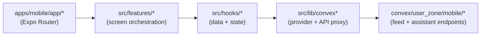

# Mobile Architecture (Expo Router → Features → Hooks → Convex)

---

## WHY

Mobile is the fastest way users can experience Anan. The architecture must keep:

- UI code simple,
- state orchestration predictable,
- and backend contracts stable.

---

## WHAT

This chapter documents the mobile flow:

- Expo Router entrypoints,
- feature modules (screen-level orchestration),
- hooks (data + assistant state),
- Convex endpoints (user_zone mobile functions).

---

## HOW (Typical flow)

### Design rules

- Feature modules own composition of UI blocks and hooks.
- Hooks own:
  - paging,
  - optimistic UI state,
  - assistant sheet state,
  - and mapping server results into UI-ready DTOs.
- Convex endpoints own:
  - filtering rules,
  - ownership rules,
  - and stable query projections.

---

## Where to change code

- Feed endpoints: `convex/user_zone/mobile/feed.ts`
- Mobile assistant endpoints: `convex/user_zone/mobile/assistant.ts`
- Feed hook: `apps/mobile/src/hooks/usePropertyFeed.ts`
- Assistant hook: `apps/mobile/src/hooks/usePropertyAssistant.ts`

---

## Common pitfalls

- Allowing mock data to “fill missing fields” from real backend items.
- Drifting hook return shapes without updating feature modules.
- Passing raw Convex document shapes directly into components.

