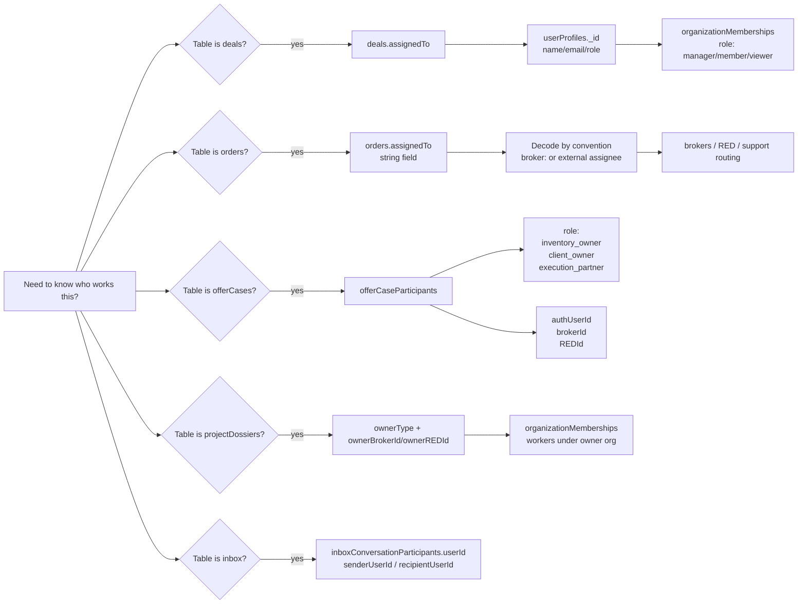
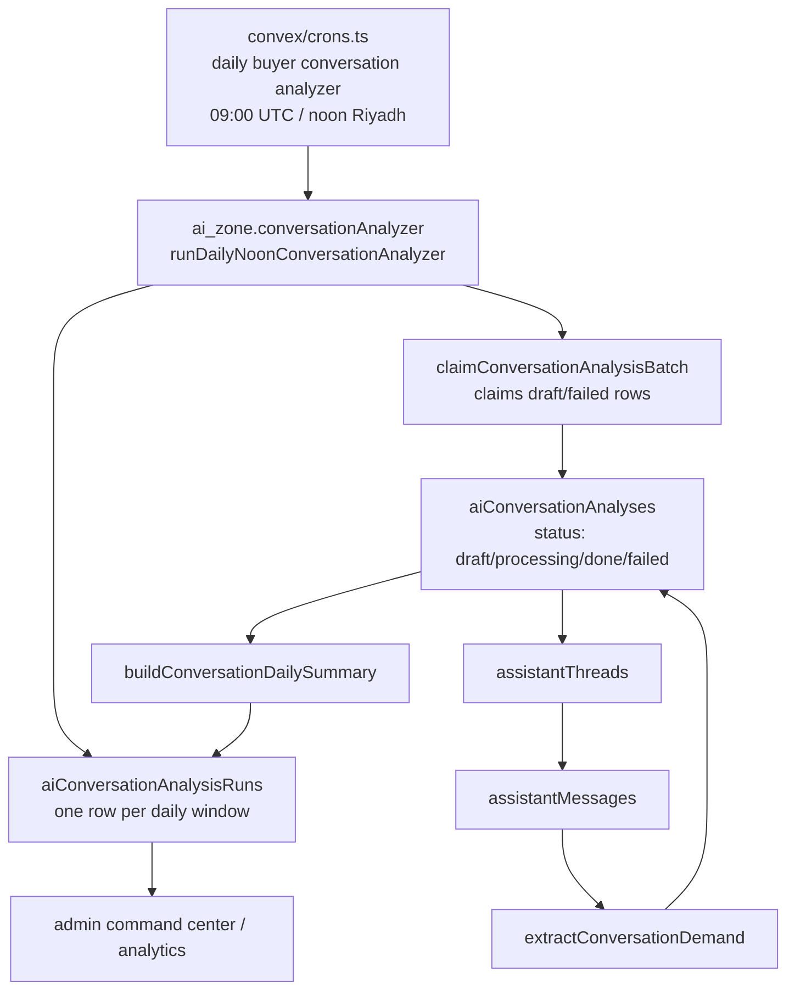

# Schema Worker Flowchart

This map shows where to look when you need to answer: "who owns this record, who is assigned to work it, and what background worker processes it?"

## Main Ownership Flow

```mermaid
flowchart TD
  AuthUser["Auth user / channel user"]
  UserProfile["userProfiles\nworker identity\nrole + brokerId/REDId"]
  Buyer["users / mobileBuyerAccounts\nbuyer identity"]

  Broker["brokers\nbroker organization"]
  RED["RED\ndeveloper organization"]
  OrgProfile["organizationProfiles\nBetter Auth org metadata"]
  TenantLink["tenantOrgLinks\nlegacy tenant bridge"]
  Membership["organizationMemberships\norg worker membership\nmanager/member/viewer"]
  Invite["teamInvites\npending worker invite"]

  Property["properties\ninventory/listing"]
  Dossier["projectDossiers\nproject readiness owner"]
  Units["projectUnits"]
  Plans["projectPaymentPlans"]
  Docs["projectComplianceDocuments"]
  Licenses["projectAdLicenses"]
  Authz["projectBrokerAuthorizations"]
  ReadinessEvents["projectReadinessEvents"]

  Order["orders\nsales lead queue\nassignedTo string"]
  Client["crmClients\nCRM contact"]
  Deal["deals\nCRM pipeline\nassignedTo -> userProfiles"]
  Offer["offers\nproperty offer"]
  Package["offerPackages\npublished/private inventory package"]
  Case["offerCases\ncollaboration / offer workflow"]
  Participant["offerCaseParticipants\nworker role in case"]
  Activity["offerActivities\ncase audit trail"]

  Inbox["inboxConversations"]
  InboxParticipant["inboxConversationParticipants"]
  Message["inboxMessages"]
  Notification["workspaceNotifications"]

  AssistantThread["assistantThreads / assistantThreadState"]
  AssistantMessage["assistantMessages / assistantMessageState"]
  BuyerState["buyerChannelStates"]
  Memory["agentMemory / userKnowledgeBase"]
  Analysis["aiConversationAnalyses"]
  AnalysisRun["aiConversationAnalysisRuns"]

  AuthUser --> UserProfile
  AuthUser --> Buyer
  UserProfile -->|brokerId| Broker
  UserProfile -->|REDId/developerId| RED
  UserProfile -->|authUserId + profileId| Membership
  Membership -->|ownerBrokerId| Broker
  Membership -->|ownerREDId| RED
  Invite -->|acceptedBy/profile created| Membership

  OrgProfile -->|legacyOwnerBrokerId| Broker
  OrgProfile -->|legacyOwnerREDId| RED
  TenantLink -->|ownerBrokerId| Broker
  TenantLink -->|ownerREDId| RED

  Broker -->|brokerId / ownerBrokerId| Property
  RED -->|REDId / ownerREDId| Property
  Property --> Dossier
  Dossier --> Units
  Dossier --> Plans
  Dossier --> Docs
  Dossier --> Licenses
  Dossier --> Authz
  Dossier --> ReadinessEvents

  Buyer -->|userId| Order
  Property -->|propertyId| Order
  RED -->|REDId| Order
  Order -->|assignedTo text\nexample: broker:<id>| Broker

  UserProfile -->|ownerAuthUserId| Client
  Broker -->|brokerId| Client
  RED -->|REDId| Client
  Client -->|crmClientId| Deal
  Property -->|propertyId| Deal
  Broker -->|brokerId / relatedBrokerId| Deal
  RED -->|REDId| Deal
  UserProfile -->|assignedTo| Deal

  Property --> Offer
  Broker -->|from/to broker| Offer
  RED -->|from/to RED| Offer
  Offer -->|sourceConversationId| Inbox
  Property --> Package
  Package --> Case
  Case --> Participant
  Participant -->|authUserId| UserProfile
  Participant -->|brokerId| Broker
  Participant -->|REDId| RED
  Case --> Activity
  Case -->|linkedDealId| Deal

  AuthUser --> InboxParticipant
  Inbox --> InboxParticipant
  Inbox --> Message
  AuthUser --> Notification

  Buyer -->|userId/channel| BuyerState
  Buyer -->|userId| AssistantThread
  AssistantThread --> AssistantMessage
  AssistantThread --> Analysis
  AnalysisRun --> Analysis
  Buyer --> Memory
```

## Worker Lookup Flow

## Background Worker Flow

## Quick Answer: Where Is The Worker?

| Work area | Field/table to inspect | What it means |
| --- | --- | --- |
| Organization staff | `organizationMemberships.profileId`, `authUserId`, `role` | Human worker inside a broker or RED organization. |
| User profile | `userProfiles.role`, `brokerId`, `REDId`, `developerId` | The app identity for a worker/member and the org they belong to. |
| CRM deal | `deals.assignedTo` | Direct pointer to `userProfiles._id`; this is the cleanest human assignee. |
| Sales order / lead | `orders.assignedTo` | Text assignee convention, currently not a strict foreign key. Example from mobile assistant: `broker:<id>`. |
| Offer/collaboration case | `offerCaseParticipants` | Human/org participants and their job in the case: `inventory_owner`, `client_owner`, or `execution_partner`. |
| Project/listing ownership | `properties.ownerType`, `brokerId`, `REDId`; `projectDossiers.ownerBrokerId`, `ownerREDId` | The broker/RED that owns the inventory. Look up org members for the humans. |
| Inbox work | `inboxConversationParticipants.userId`, `inboxMessages.senderUserId`, `recipientUserId` | Conversation participants by auth/channel user id. |
| System worker | `convex/crons.ts` + `ai_zone/conversationAnalyzer.ts` | Daily background worker that analyzes buyer conversations. |

## Notes

- `deals.assignedTo` is the strongest "who is working this" pointer because it references `userProfiles`.
- `orders.assignedTo` is looser because it is a string. Treat it as a routing label unless the code that wrote it uses a known prefix like `broker:<id>`.
- Project ownership is organization-level first. To find the human workers, go from `ownerBrokerId` or `ownerREDId` to `organizationMemberships`.
- Offer cases can have multiple workers at once through `offerCaseParticipants`, so read the participant role before deciding ownership.
